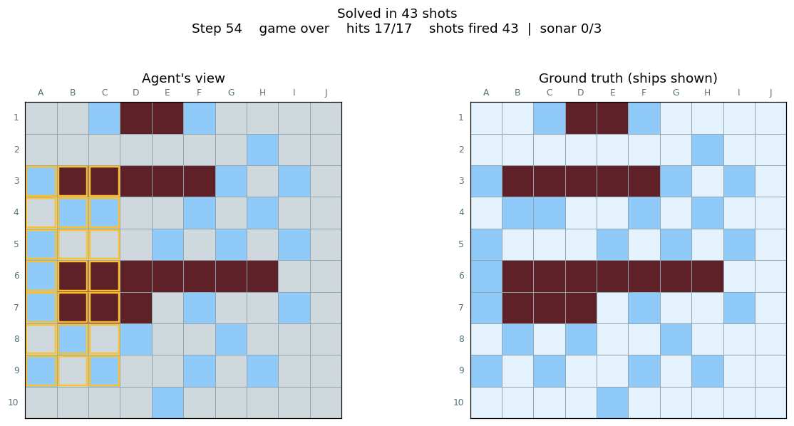
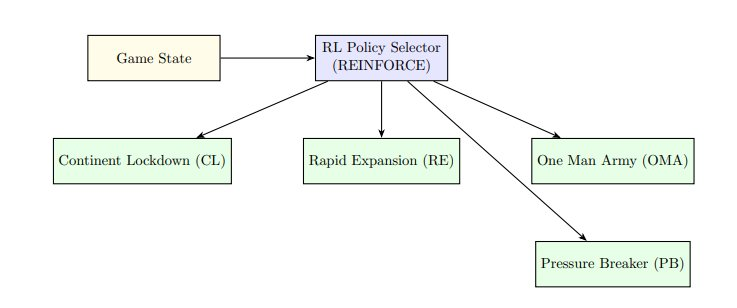
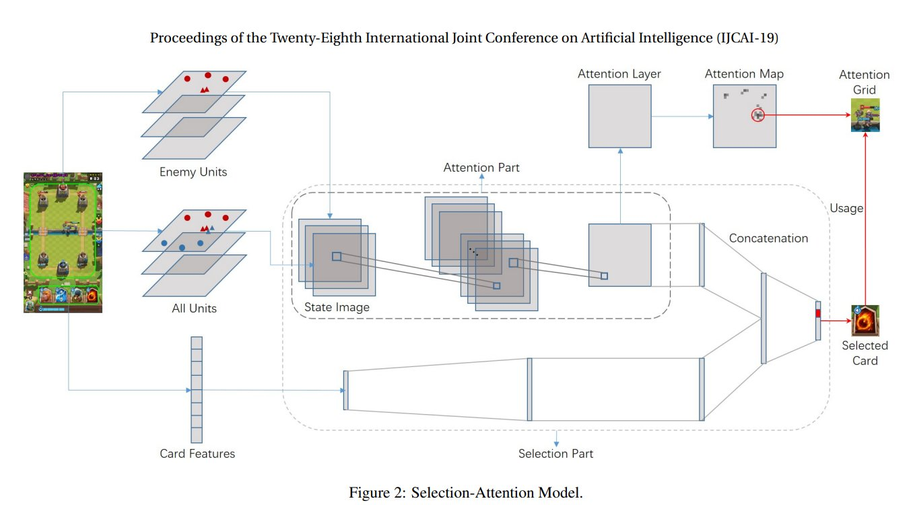
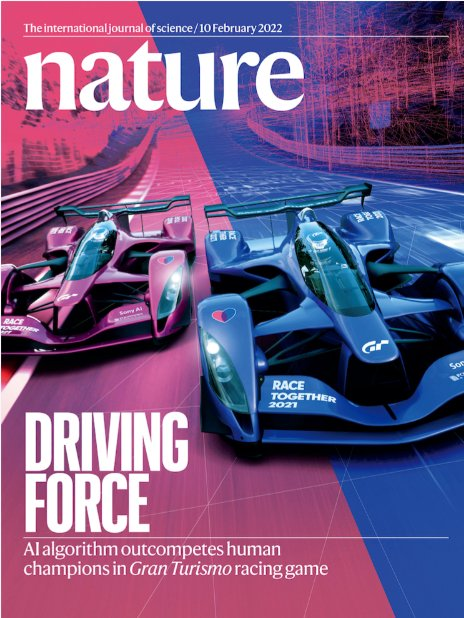
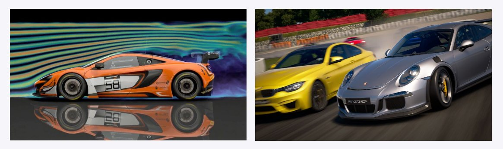
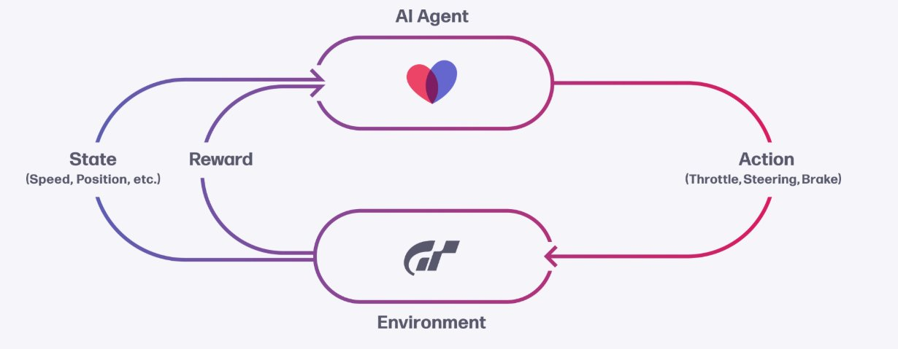

# Chapter 11 – Applications in Games

**Authors:** Omar Fouad (.1,.2,.4), Ahmed Alaa Hamdy (.3,.5)
*German University in Cairo, CSEN 1152 – Spring 2026*

---

## Introduction

Rivalry is an instinct engraved in the human mind since the discovery of fire - we have always aimed to best our opponents, achieve victory again and again, and improve our strategy, whether it be in survival, attaining wealth, or fame. In the modern world this drive is most prevalent in games. Chess, for example, was once used to settle disputes between kingdoms and was crowned for a time the most prestigious game of intellect, with one's mastery of the game equated to their intelligence. As chess evolved, so did the methods of finding the most optimal strategy, segmenting into its own field of chess theory. 1988 would mark a turning point for chess history as it was the first documented case of a computer (Deep Thought) defeating a Grandmaster in tournament play - a milestone that culminated nine years later in Deep Blue's defeat of reigning world champion Garry Kasparov. From there, the flames of competition pushed search algorithms and research to their limits, all in service of knowing the best move at any point.

From a novice's perspective the rules of chess are quite clear and simple, they could roughly be written on three pages, and yet there are more legal board positions in chess than there are atoms in the observable universe. What if pawns could suddenly turn into other pieces, you could make more than one move per turn, the board itself changed mid-game, or you couldn't see what the opponent played? Suddenly we are dealing with a much more variable and complex problem. Traditional search algorithms can no longer compute such variations, and we can't account for every case by hand which leads us to applying **Reinforcement Learning (RL)** to video games.

RL does not begin with a known good method of play. Instead, the agent plays millions of games and is rewarded for the moves that lead toward winning. This means that regardless of the complexity of the environment, with enough games the agent will discover sequences of moves that maximize the rewards it collects. Video games offer a closed, well-defined world for an RL agent to train in, and without physical limitations RL agents can train adversarially against each other, play thousands of games per day, and run multiple sessions concurrently providing a large source of data.

Through this chapter we will first turn the virtual game environment into a standard formal MDP problem to dissect, then explore its applications across games of gradually increasing complexity, the challenges that arose at each tier, and how research from video games is helping inform other real-world applications.

---

## 11.1 Formulating a Game as an RL Problem

Before we dive into specific games, let us set up the shared vocabulary. In RL, every problem is modeled as a **Markov Decision Process (MDP)**, defined by:

- **State (S):** What the agent can observe about the world
- **Action (A):** What choices the agent can make
- **Reward (R):** The signal that tells the agent how well it is doing
- **Transition:** How the world changes after each action

Compared to the traditional use of RL agents in optimal control and robotics, games map onto this framework just as naturally:

<div align="center">

| Concept | Robotics | Video Game |
|---|---|---|
| **State** | Sensor readings | Board position, unit health, resources |
| **Actions** | Servo commands | Button presses, mouse clicks, ability casts |
| **Environment** | Physical world with real constraints | A customizable virtual world |
| **Agent** | Robot arm, drone | Any in-game character or player entity |

</div>

To build our state vector we need a way to read the game's internals. The cleanest path is to edit the game's source code directly and extract the metrics we care about. In practice, however, game studios are unlikely to let third parties inspect their code, and in more complex games the engine's architecture makes modification impractical regardless. The standard workaround is to feed the raw game image (a grid of pixels) through a **Convolutional Neural Network (CNN)** to extract a meaningful internal state vector. The agent then reasons on top of that compressed representation rather than on raw pixels.

One key thing to note early: not all video games are equal. The complexity of the RL problem scales dramatically with the game:

- **Small, tractable environments** (Battleship): Discrete grids and a hand-enumerable action set
- **Large, near-infinite environments** (Clash Royale, RISK): Many continuous variables and combinatorial moves
- **Effectively infinite environments** (Dota 2, StarCraft II): Real-time, multi-agent worlds requiring coordination

We will explore each in order.

---

## 11.2 Finite States: RL in Simple Environments

### 11.2.1 Case Study — Battleship

Battleship is a two-player game where each player arranges ships on a 10×10 grid hidden from the other, then takes turns guessing coordinates to "fire" at the opponent. The first to sink all enemy ships wins. Standard rules use five ships of sizes 5, 4, 3, 3, 2 — seventeen ship cells in total — and forbid overlap or diagonal placement.

The game is deceptively simple — it introduces several unique problems:

**1. Partial Observability**
The agent never sees the opponent's actual true board. It only knows the history of its own shots (hits and misses). This makes Battleship a **Partially Observable MDP (PO-MDP)**. The agent must act on belief rather than complete information.

**2. Two Learnable Policies**
An RL agent in Battleship actually needs to learn two things:
- **Placement policy:** Where to position its own ships to be hard to find
- **Shooting policy:** Where to fire to find and sink enemy ships most efficiently

**3. Exploration vs. Exploitation**
Should the agent keep firing around a known hit (exploit) or venture to an untested area (explore)?

Because each cell can be unknown, a hit, or a miss — and each combination represents a distinct belief state — the agent's belief space is on the order of **3¹⁰⁰ ≈ 5 × 10⁴⁷**. Even for a "simple" game, that already rivals the legal-position count of chess.

**Battleship as a PO-MDP:**

<div align="center">

| Component | Details |
|---|---|
| **State** | Known shot history, known ship placements |
| **Hidden State** | Enemy board (partially observable) |
| **Actions** | Place a ship / Fire at a coordinate |
| **Reward** | +1 for hit, penalty for miss or wasted shot |

</div>

**Project Build — Adversarial PPO Self-Play (Fouad, 2026)**

To explore these ideas and self learn it, I built a working Battleship agent (Fouad, 2026) that learns both the placement and shooting policies through adversarial self-play. The implementation uses masked PPO (Proximal Policy Optimization) with two convolutional neural networks (one shooter, one placer)that are trained against each other in alternating rounds.

*State representation.* Instead of feeding the network a raw board, the shooter receives a 4-channel one-hot tensor of shape `(4, 10, 10)`, where each channel marks cells in one of four states: `unknown`, `miss`, `hit`, or `sunk`. The placer sees a 2-channel tensor: occupied cells plus the normalized size of the ship currently being placed.

*Action masking.* At every step, the network outputs logits over all 100 cells, but a boolean mask of legal actions (cells not yet fired at, for the shooter; valid `(row, col, orientation)` triples that don't overlap, for the placer) is applied before the softmax. This is implemented with a masked categorical distribution that sets illegal logits to `−10⁹`, to ensure an agent doesnt consider an illegal move.

*Rewards.* The shooter is rewarded `+1` for a hit, `−0.05` for a miss, `+1` bonus for sinking a ship, and `+5` for winning the game.

*Sonar ability.* 3 charges per game, each revealing whether any ship occupies a 3×3 area centered on the chosen cell. The action space doubles (200 actions: 100 fire targets + 100 sonar centers) and the observation grows to 7 channels (adding `sonar_cleared`, `sonar_yes_overlap`, and `charges_remaining`). The agent must learn when to spend an important action versus committing to a shot.

*Phased adversarial training.* Joint self-play causes the placer and shooter to find nonesensical strategies. Instead, training runs in phases:

1. **Phase 1 — Shooter pretraining.** The shooter trains for a large amoutn of PPO updates against a random placer to acquire a basic seek and destroy strategy.
2. **Phase 2+ — Alternating self-play.** Each round a snapshot of one network is taken and trains the other against it. The placer is rewarded by the number of shots required by the shooter to win while the shooter is rewarded by how quickly it sinks all ships.

Two designs were made to avoid mode collapse after initial testing:

- **Fictitious self-play with snapshot pools.** The placer is evaluated against a mix of recent shooter snapshots plus a hard coded seek and destroy heuristic, not just the latest shooter. This prevents the placer from overfitting to one opponent.
- **D4 symmetry augmentation.** Each placement is randomly rotated/flipped before the shooter sees it. Otherwise the shooter assumes all ships are horizontal.


<div align="center">



*Figure 11.1: A trained shooter solving a board in 43 shots. The agent's view (left) shows confirmed hits, misses, and sunk ships; the ground truth (right) shows where the placer hid the ships. The orange-bordered cells in the left panel mark the placer's true ship cells revealed at game end. (Fouad, 2026)*

</div>

*Results.* On a 10×10 board with the standard fleet (17 ship cells, so 17 is the theoretical minimum):

The full source is available at the project repo. 

---

## 11.3 Infinite States: RL in Continuous Environments

### 11.3.1 The Jump from Grids to Continuous Space

Battleship's 100 possible grid coordinates feel manageable. But many real-time games involve characters that can move to *any* (x, y) coordinate — meaning the state space is, in principle, infinite. This is where tabular methods (Q-tables that store a value for every state) break down completely, and we need function approximation — typically neural networks.

### 11.3.2 Case Study — RISK: Policy Gradients in a Strategy Game

RISK is a classic board game of global domination. The game is played on a world map divided into **42 territories** grouped into **6 continents** (North America, South America, Europe, Africa, Asia, and Australia). Players control armies and take turns reinforcing, attacking, and fortifying. The endgame goal: eliminate all other players.

<div align="center">


*Figure 11.2: Overview of the RL meta-controller for RISK, showing the four expert strategies and the 73.1% win rate achieved. (Hamdy, 2025)*

</div>


**Why is RISK hard for RL?**

- **Infinite-ish state space:** Troops can be distributed in astronomically many ways across 42 territories
- **Long time horizons:** A single game averages around **114 turns**, creating a severe **sparse reward problem** — the agent only gets a clear win/loss signal at the very end
- **Strategic depth:** Different phases of the game require fundamentally different strategies
- **Stochasticity:** Battle outcomes depend on dice rolls, introducing randomness that can override even the best-laid plans

**The Environment as an MDP**

To apply RL to RISK, the game must be formally encoded as an MDP. Here is how each component maps:

<div align="center">

| MDP Component | RISK Encoding |
|---|---|
| **State S** | 50-dimensional vector (see below) |
| **Actions A** | Which of 4 expert strategies to deploy |
| **Reward R** | Shaped signal based on territory/continent events |
| **Transition T** | Determined by strategy execution + dice randomness |
| **Policy π** | A neural network mapping state → strategy probabilities |

</div>

**The State Vector — What the Agent Actually Sees**

Rather than processing the raw game board, the agent observes a compact **50-dimensional state vector** constructed from domain-specific features:

- Number of territories controlled by the agent and each opponent
- Current troop strength distribution across territories
- Number of border territories and their vulnerability scores (enemy-adjacent frontiers)
- Strength and proximity of enemy forces
- Control status of each of the 6 continents (binary flags)
- **One-hot encoded game phase:** Early (turns 0–30), Mid (turns 30–70), Late (turn 70+)

The game phase encoding is critical. By pre-profiling 50 games against each rule-based AI, researchers found the average game lasts roughly 114 turns, which informed where phase boundaries were drawn. The agent can then learn *different* strategies for each phase rather than a single fixed approach.

```python
def _get_game_phase(self):
    """Determine current game phase"""
    turn = getattr(self.game, 'turn', 0)
    if turn < 30:
        return 'early'
    elif turn < 70:
        return 'mid'
    else:
        return 'late'
```

**The Solution: Hybrid RL — Meta-Policy over Expert Strategies**

Rather than learning every low-level action (which territory to attack, how many troops to move), the agent operates as a **meta-controller**: it learns *which high-level strategy to use*, and delegates the actual moves to one of four hand-crafted expert modules:

<div align="center">

| Strategy | Core Idea | Best Phase |
|---|---|---|
| **CLD** – Continent Lockdown | Secure full continents for bonus troops | Early |
| **OMA** – One Man Army | Concentrate troops into one massive attack force | Mid–Late |
| **PB** – Pressure Breaker | Disrupt enemy continent bonuses | Mid |
| **RE** – Rapid Expansion | Probability-optimized aggressive attacks | Late |

</div>

This hybrid design dramatically reduces the action space: instead of choosing among thousands of possible territory moves, the agent picks among just 4 options. The selected strategy then executes its own logic for all low-level decisions.

<div align="center">



*Figure 11.3: The meta-controller architecture. The game state is fed into a REINFORCE-based policy selector, which picks one of four expert strategies each turn. (Hamdy, 2025)*

</div>


**The Policy Network Architecture**

The neural network that selects strategies is a **multilayer perceptron (MLP)**:

<div align="center">

```
Input: 50-dimensional state vector
  ↓
Hidden Layer 1: 64 units, ReLU activation
  ↓
Layer Normalization
  ↓
Hidden Layer 2: 64 units, ReLU activation
  ↓
Output Layer: 4 units (one per strategy)
  ↓
Softmax → strategy probability distribution
```

</div>

Action selection uses **epsilon-greedy exploration**: with probability ε, a random strategy is chosen (to explore); otherwise, the strategy is sampled from the softmax output (to exploit learned knowledge). ε decays slowly over training to shift from exploration toward exploitation.

<div align="center">


*Figure 11.4: Detailed RL system architecture. The state observer encodes the game state, the policy network selects a strategy via epsilon-greedy sampling, rewards are calculated from game events, and policy updates run every episode via REINFORCE. (Hamdy, 2025)*

</div>


**The Reward System — Shaped for Strategy**

Raw win/loss signals are too sparse for a 114-turn game. The reward function provides dense intermediate feedback:

<div align="center">

| Event | Reward |
|---|---|
| Win the game | +15 |
| Lose the game | −15 |
| Conquer a territory | +3 |
| Complete a continent (early game) | +8 additional |
| Complete a continent (mid game) | +5 additional |
| Complete a continent (late game) | +2 additional |
| Lose a territory | −3 |
| Lose continent control | −5 additional |
| Complete continent during initial placement | +8 |

</div>

The phase-dependent bonuses reflect real strategic value: owning a continent early compounds across dozens of turns (extra troops every turn), while winning a continent in the late game provides much smaller returns. This phase-aware design guides the agent to prioritize continent control early and shift to aggressive finishing in the late game.

**The REINFORCE Learning Algorithm**

After each episode, the agent computes discounted returns for every decision:

$$G_t = \sum_{k=0}^{T-t} \gamma^k r_{t+k}$$

These returns weight the policy gradient loss:

$$\mathcal{L} = -\sum_t \log \pi_\theta(a_t | s_t) \cdot G_t$$

An **entropy bonus** is added to prevent the policy from collapsing to always picking one strategy too early. Gradients are clipped before the Adam optimizer step to prevent unstable updates.

**Results and Learned Behavior**

- Trained over **16,000 games** against a RandomAI baseline (first 2,000 with fixed ε to force exploration of all strategies)
- Achieved a **73.1% win rate** — a 17% advantage over the best single rule-based strategy (OMA at 56.4%)
- The agent learned **phase-specific strategy preferences**: CLD slightly preferred in early game, PB dominant in mid game, RE heavily preferred in late game — all without being told which strategy suits which phase

<div align="center">

| Strategy | Win Rate vs Random |
|---|---|
| CLD | 29.5% |
| OMA | 56.4% |
| PB | 37.5% |
| RE | 41.2% |
| **RL Agent** | **73.1%** |

</div>

An early training challenge was reward imbalance causing the agent to over-rely on one strategy across all phases. This was corrected through careful reward function tuning and a reduced epsilon decay rate — a reminder that **reward design is often the hardest part of RL engineering**.

> 🤔 **Reflect:** Why would a fixed strategy always lose to an adaptive one in a game like RISK? Think about how an opponent could exploit any predictable pattern. Now think about why learning *when* to use each strategy is more valuable than just having the best strategy.

---

### 11.3.3 Case Study — Clash Royale: SEAT Architecture

Clash Royale is a real-time strategy (RTS) mobile game where two players simultaneously deploy troops, spells, and buildings on a shared arena (32,000 × 18,000 pixels) trying to destroy the opponent's towers within a three-minute match.

<div align="center">


*Figure 11.5: The Clash Royale arena annotated with key game elements. The RL agent must observe all of these simultaneously to make decisions. (Chen et al., 2019)*

</div>


**Why is Clash Royale harder than RISK?**

- **Continuous real-time positioning:** The entire map is the state, updated many times per second
- **Imperfect information:** The opponent's hand cards and available elixir (the resource used to deploy units) are hidden
- **Simultaneous decisions:** Both players act at the same time; there are no clean "turns"

**The Solution: The SEAT (Selection-Attention) Model**

Researchers cleverly divided the decision into two sub-problems handled by two separate neural networks:

1. **Selection Network (What to play):** Evaluates the current board and card features to choose *which* card to deploy
2. **Attention Network (Where to play):** Generates a spatial attention map over the arena to identify *where* the card should be placed

This divide-and-conquer approach mirrors how human expert players actually think: first decide what to use, then decide where to use it.

<div align="center">



*Figure 11.6: The SEAT (Selection-Attention) model architecture. Enemy unit maps and card features are processed by two sub-networks: the Selection Part chooses which card to play, and the Attention Part identifies where to deploy it. (Chen et al., IJCAI 2019)*

</div>


**Results:**
- **90% win rate** against aggressive and defensive rule-based bots
- **70% win rate** against decision-tree agents (which have hand-coded strategy logic)
- The agent independently learned **defensive positioning** and **unit counters** — e.g., using a cheap ranged unit to distract a slow tank — without being explicitly programmed with these tactics

---

## 11.4 Complex Infinite States: Multi-Agent RL in MOBAs and RTSs

### 11.4.1 Importance of Multi Agent RL (MARL)

Now the most complex area were most research is centered. Games like Dota 2 (Multiplayer Online Battle Arena) and StarCraft II (Real-Time Strategy game) are more complex than anything discussedso far. They require multiple agents working together against multiple opponents, all in real time, with incomplete information with both micro and macro scale decission, some actions are rewarded once every 1/4th of a frame and others after 20 minutes of game time have elapsed.

**The core challenges of MARL in complex games:**

<div align="center">

| Challenge | Detail |
|---|---|
| **Partial Observability** | Large maps with "fog of war" where agents cannot see the whole map |
| **Sparse & Delayed Rewards** | Games last 30–60 minutes at high frame rates; credit assignment is difficult |
| **Team Coordination** | Agents must collaborate, individual reward signals are insufficient |
| **Scalability** | More agents = exponentially more states and joint actions to reason over |

</div>

To give you a sense of scale: MOBAs like Dota 2 can reach state spaces on the order of **10²⁰⁰⁰⁰**

---

### 11.4.2 Case Study — League of Legends: A MOBA Agent

League of Legends (LoL) is played on a roughly 16,000 × 16,000 unit map with three lanes, a jungle, towers, inhibitors, a Nexus, and dozens of jungle and special monsters. Each player controls a unique champion with distinct abilities, buys items mid-game, fights enemy minions, and coordinates with four teammates to destroy the enemy base.

**Architecture Highlights**

Modern MOBA RL agents (Ye et al. 2020) use an Actor-Critic paradigm with a multi-input neural network rather than one monolithic encoder. The state is decomposed by type, with each branch handled by an architecture suited to its data:

<div align="center">

```
Spatial Feature  (mini-map, terrain)         → CNN  ┐
Unit Feature     (heroes, minions, monsters, → MLP  │
                  turrets, per-entity stats)        │
In-game Stats    (gold, XP, time, objectives) → MLP ├→ FC → LSTM → Multi-Head Value
Invisible Opp.   (estimated from observed)   → MLP  │           ↓
                                                    │      ┌──────────────────┐
                                                    │      │ Farming Related  │
                                                    │      │ KDA Related      │
                                                    │      │ Damage Related   │
                                                    │      │ Pushing Related  │
                                                    │      │ Win/Lose Related │
                                                    │      └──────────────────┘
                                                    ↓
                                              Action Mask
                                                    ↓
                              What?  (Move / Attack / Skill / Return)
                              How?   (Move offset, Skill offset Δx, Δy)
                              Who?   (Target unit)
```

</div>

From the diagram there are 3 important take aways in order to properly train MARL agents in such a complex environment.

- **Long Short Term Memory (LSTM).** A MOBA state cannot be summarized by a single frame — the agent has to remeber enemy actions, recent self actions, recent game information.
- **Multi-head value.** Rather than estimating one all encompasing value for a state, the critic outputs multiple value heads for each type of acction, to what category it contributes and how impactfull is the value gained overall. With the value heads split, the gradient minimzing in the credit section is now easier to allocate which value is returned from which action and the appropriate reward.
- **Hierarchical, masked action.** The action is decomposed into what (move/attack/skill/return-to-base), how (where to move, where to aim a skill), and who (which enemy unit to target). An action mask zeroes out illegal combinations before sampling.

What differes from implementation to another in 3D complex games is the way agents are trained and how the data is aquired.
**Training Pipeline (Three Phases)**

To handle a roster of 100+ champions, training is staged so the agent does not have to learn everything from scratch on every team composition:

1. **Phase 1 — Fixed-lineup teachers.** Several specialist agents are trained, each on a fixed 5-vs-5 lineup. 
2. **Phase 2 — Multi-teacher policy distillation.** A single student (collection of fized lineups) network learns from the pool of teachers via a distillation loss, using a replay buffer and student-driven exploration so it does not just copy teachers and prevent overfitting.
3. **Phase 3 — Random-pick training.** Ten heroes are sampled at random each episode, forcing the distilled student to generalize across the full draft space rather than memorizing a few lineups.

---

### 11.4.3 Case Study — Dota 2: OpenAI Five

Dota 2 offers even more depth to the comprehensive systems that are found in MOBAs mentioned before. So instead of an inhouse made RL agent we can look at OpenAI's OpenaAI Five RL model to play Dota 2.

**The algorithm.** OpenAI Five used a scaled-up version of PPO combined with Generalized Advantage Estimation (GAE) and a separate LSTM per agent. Which is standard with the exception of the GAE.

**Scale of training.**
OpenAI Five ran 180 years of gameplay per day on 128,000 CPU cores and 256 P100 GPUs. With matches averaging 45 minutes of game time, 2 million games could be generated as data points and used for training per day.

**Results.**
The average skill required to play the games was quantified (TrueSkill)and then models were mapped how much computing time was required to reach the targat to beat certain percentile of players. The curve climbs smoothly from random play (TrueSkill ≈ 0) up through hand-scripted bots (100), amateur teams (205), semi-pro teams (210), the casters' benchmark (235). However it took significant computation to after reaching 210 to beat the world champions (255) at 750 PFLOPs/s-days of training compute.
A subsequent OpenAI Five Rerun redid the training on a different cluster (51,200 CPUs, 1,024 GPUs) and reached TrueSkill of 255 in two months instead of 10.

---

### 11.4.4 Case Study — StarCraft II: AlphaStar

If Dota 2 is chess in real time, StarCraft II is chess in real time while also managing an entire country. Two players build bases, harvest resources, train different unit types, and attempt to destroy each other's bases, all in real time without turns.

Google DeepMind built AlphaStar to also reach world class skill level in StarCraft II.

**StarCraft II Challenges**

- **Long-horizon planning:** Strategic decisions made early in the game affect the outcome 10 minutes later
- **Simultaneous macro and micro:** Players must manage their overall economy (macro) while also controlling individual units in combat (micro)
- **Game-specific strategies:** Three very different factions (Terran, Zerg, Protoss) with distinct units and mechanics and different maps

**The action-rate cap**
A common criticism of bots in real-time games is that they win by inputing more actions per second than humanly possible. DeepMind explicitly engineered AlphaStar to defuse that issue and to focus purely on strategy. The agents' actions per second was capped and deliberate processing delay to mimic human reaction time.

Each action is structured in to the same acrion heirarchy of What, Who and Where. However a Fourth action is required to account for the long term horizon nature

**When next?** A learned delay until the next action

**AlphaStar's Training Pipeline**

AlphaStar used a three-stage approach and a mix of both supervised and reinforcment learning:

1. **Supervised pre-training:** Learn from recorded human games to get a reasonable starting policy.
2. **Reinforcement learning against fixed opponents:** Improve the policy using experience.
3. **League training and KL-Divergence:** A pool of agents containing current agents and historical snapshots of past agents. The KL divergence loss function included a term that penalized the agent for diverging too far from human playing styles

The League's key innovation was the 3 types that compose it, each playing a distinct role:

<div align="center">

| Population | Role |
|---|---|
| **Main agents** | The protagonists. Trained to be strong against the entire League, including past snapshots of themselves |
| **Main exploiters** | Adversaries trained specifically to find and exploit weaknesses in the current main agents |
| **League exploiters** | Adversaries trained to find weaknesses anywhere in the League (current + historical) |

</div>

This three-tier population is the highlight of this study case as it avoids the failure of naive self-play, pure self-play tends to cause mode collapse and fails to produce varied data. Main exploiters force generalization in the present while league exploiters preserve historical breadth.

**Results:**
- AlphaStar achieved Grandmaster level in all three StarCraft II factions
- It defeated multiple professional players in closed testing.
- Its actions per minute matched that of human play which highlighted its strategy thinking more than just raw input.

<div align="center">

```
AlphaStar Training Flow:
Human Replays  →  Supervised Learning  →  Base Policy
                                                 ↓
                                         RL vs Fixed Opp.
                                                 ↓
                          ┌──────────────────────┼──────────────────────┐
                          ↓                      ↓                      ↓
                   Main Agents         Main Exploiters       League Exploiters
                          └──────────────────────┼──────────────────────┘
                                                 ↓
                                       Grandmaster-Level Agent
```

</div>

---

## 11.5 RL Beyond the Screen: Sim-to-Real Transfer

One of the most exciting implications of game-based RL is **sim-to-real transfer**: using a game or simulation as a safe, cheap training environment, then deploying the learned policy in the physical world.

Games are not just entertainment — they are increasingly accurate physics simulators.

### 11.5.1 Case Study — Gran Turismo Sophy (GT Sophy)

Gran Turismo is a hyper-realistic racing simulation that models tire friction, air resistance, and suspension geometry with extraordinary fidelity. Sony AI built **GT Sophy** — an RL agent trained entirely within the game — that went on to beat world champion human drivers.

<div align="center">



*Figure 11.7: GT Sophy's results were published on the cover of Nature (February 2022), marking the first time an RL agent surpassed world-champion human drivers in a realistic racing simulation. (Wurman et al., 2022)*

</div>


<div align="center">



*Figure 11.8: Gran Turismo models real aerodynamics and physics (left), making it an unusually faithful simulation environment for training agents intended for real-world transfer (right).*

</div>


**The Algorithm: QR-SAC (Quantile-Regression Soft Actor-Critic)**

GT Sophy used a variant of the Soft Actor-Critic (SAC) algorithm with **distributional RL**: instead of predicting a single expected reward, the agent predicts a *distribution* of possible outcomes. This is crucial in racing, where a tiny mistake at high speed (say, clipping a wall at 200mph) can have catastrophic consequences — the agent needs to reason about worst-case scenarios, not just averages.

A unique addition was an **etiquette reward**: penalties for unsportsmanlike behavior like collisions, forcing opponents off the track, or dangerous blocking maneuvers. This ensured the agent would race aggressively but *fairly*.

<div align="center">


*Figure 11.9: The three capabilities GT Sophy mastered: precise car control, tactical racing maneuvers, and fair-play etiquette — each enforced through careful reward design. (Sony AI / Gran Turismo Sophy)*

</div>


**Training Timeline:**

<div align="center">



*Figure 11.10: The GT Sophy RL training loop. The agent observes speed, position, and other physical state variables from the Gran Turismo environment, and outputs continuous control actions — throttle, steering angle, and braking force. (Sony AI)*

</div>


<div align="center">

| Duration | Milestone |
|---|---|
| 2 hours | Learns to stay on track safely |
| 2 days | Beats ~95% of all human players |
| 10–12 days | Reaches superhuman level (~45,000 driving hours equivalent) |

</div>

**Results:**
- In October 2021, GT Sophy beat the world's best drivers **104 to 52**
- The techniques are now being explored for **autonomous driving** and **high-speed robotics**

As the creator of Gran Turismo stated: game AI research will contribute to both the future of games and automobiles.

---

## 11.6 Lessons and Broader Context

Looking across all these case studies, several themes emerge:

**1. The progression of algorithms mirrors the progression of game complexity.**
Simple tabular Q-learning works for tiny state spaces. Policy gradients handle continuous states. Deep RL with CNNs handles raw image inputs. MARL adds coordination. Distributional RL handles uncertainty. Each layer of complexity required a corresponding algorithmic innovation.

**2. Reward shaping is often the real engineering challenge.**
The hardest part of applying RL to games is rarely the network architecture — it is designing a reward signal that guides the agent toward *good* strategies. RISK needed intermediate milestones. Dota 2 needed team spirit. GT Sophy needed an etiquette penalty.

**3. Self-play is incredibly powerful.**
AlphaStar, OpenAI Five, and the RISK agent all benefited from training against themselves or past versions of themselves. Self-play prevents overfitting to any fixed opponent and can generate superhuman strategies that no human ever taught the agent.

**4. Games serve as benchmarks for capabilities we care about in the real world.**
Partial observability, long-horizon planning, multi-agent coordination, and sim-to-real transfer are all relevant to robotics, autonomous vehicles, finance, and healthcare. Every breakthrough in games is a prototype for the real world.

---

## 11.7 Ethical Considerations

RL in games raises a few concerns worth thinking about:

- **Fairness in online play:** An RL agent deployed in a competitive online game gives whoever controls it an unfair advantage. Most competitive games ban bots for this reason.
- **Addictive design:** RL techniques are used by game companies not just to build AI opponents, but to *design games themselves* in ways that maximize player engagement — sometimes at the expense of player wellbeing.
- **Sim-to-real risks:** A racing agent trained in simulation may behave unexpectedly when real-world physics differ slightly from the simulation. Rigorous testing is critical before deployment in safety-critical contexts.

---


## Summary

In this chapter, we journeyed from the humble grid of Battleship — teaching us about partial observability and exploration — all the way to the 10²⁰⁰⁰⁰-state space of Dota 2 and the real-world racing circuits of Gran Turismo.

Along the way, we saw how the core RL concepts — MDPs, policy gradients, actor-critic methods, reward shaping, and self-play — combine and evolve to tackle increasingly complex challenges. Games have proven to be not just entertainment, but the richest proving ground for AI research. And the lessons learned in virtual worlds are now driving real breakthroughs in robotics, autonomous vehicles, and beyond.

---

## References

1. Silver, D., Huang, A., Maddison, C. J., et al. (2016). Mastering the game of Go with deep neural networks and tree search. *Nature*, 529(7587), 484–489.

2. Vinyals, O., Babuschkin, I., Czarnecki, W. M., et al. (2019). Grandmaster level in StarCraft II using multi-agent reinforcement learning. *Nature*, 575, 350–354. Available at: https://www.nature.com/articles/s41586-019-1724-z

3. Li, Z., Ji, Q., Ling, X., & Liu, Q. (2025). A Comprehensive Review of Multi-Agent Reinforcement Learning in Video Games. *arXiv preprint arXiv:2509.03682*. Available at: https://arxiv.org/pdf/2509.03682

4. Berner, C., Brockman, G., Chan, B., et al. (2019). Dota 2 with Large Scale Deep Reinforcement Learning. *arXiv preprint arXiv:1912.06680*. Available at: https://arxiv.org/pdf/1912.06680

5. Hamdy, A. A. (2025). Reinforcement Learning for Risk Strategy Optimization. Bachelor thesis, Dept. Media Eng. and Tech., German University in Cairo, New Cairo, Egypt. Supervisor: Dr. Islam A. ElMaddah.

5b. Fouad, O. (2026). Adversarial PPO Self-Play for Battleship: Learning Both Placement and Shooting Policies. Course project, German University in Cairo, CSEN 1152.

6. Wurman, P. R., Barrett, S., Kawamoto, K., et al. (2022). Outracing champion Gran Turismo drivers with deep reinforcement learning. *Nature*, 602, 223–228. Available at: https://www.gran-turismo.com/us/gran-turismo-sophy/technology/

7. Chen, J., Liu, B., & Kong, F. (2019). Reinforcement learning for Clash Royale. *Proceedings of IJCAI 2019*. Available at: https://www.ijcai.org/proceedings/2019/0631.pdf

8. Sutton, R. S., & Barto, A. G. (2018). *Reinforcement Learning: An Introduction* (2nd ed.). MIT Press. Available at: http://incompleteideas.net/book/RLbook2020.pdf

9. Mnih, V., Kavukcuoglu, K., Silver, D., et al. (2015). Human-level control through deep reinforcement learning. *Nature*, 518(7540), 529–533.

10. Ye, D., Liu, Z., Sun, M., Shi, B., Zhao, P., et al. (2020). Mastering Complex Control in MOBA Games with Deep Reinforcement Learning. *Proceedings of the AAAI Conference on Artificial Intelligence*, 34(04), 6672–6679. Available at: https://ojs.aaai.org/index.php/AAAI/article/view/6144

---

*To cite this chapter, please use the following BibTeX:*

```bibtex

@misc{fouad_hamdy_2026_ReinforcementLearning,
  author       = {Omar Fouad and Ahmed Alaa Hamdy},
  title        = {Reinforcement Learning: A Gentle Introduction, Chapter 11 – Applications in Games},
  year         = {2026},
  publisher    = {GitHub},
  howpublished = {\url{https://github.com/amrmsab/reinforcement_learning_book}},
  note         = {Accessed: May 2026}
}


```


