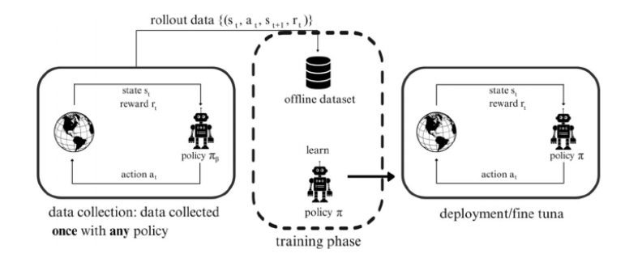
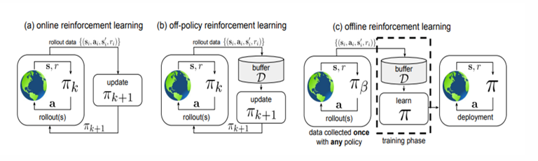
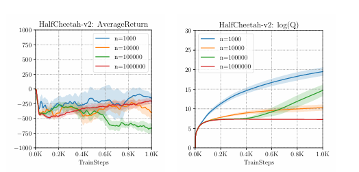
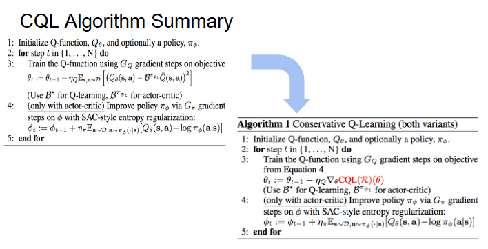

# Chapter 14: Open Challenges in Offline Reinforcement Learning; Conservative Q-Learning

### **Author**: Reem Tarek Mohamed


## Preliminaries
-  **Sutton & Barto (Reinforcement Learning: An Introduction, 2nd edition)**, particularly **Chapter 9** (function approximation) & **Chapter 11** (off-policy learning with function approximation).
- Q-Learning Algorithm
- Bellman Error
- For a complete list of mathematical symbols and their meanings used 
throughout this chapter, refer to the [List of Symbols](https://github.com/Reem3333/reinforcement_learning_book/blob/dacc0c7681b9aa9a016deb48f198e483105530bb/docs/chapter14/List%20of%20Symbols.md)

---

# 1. The Data Problem in RL

Standard RL is an **interactive** learning paradigm: an agent interacts with an environment, collects experience, and updates its policy. This creates a critical bottleneck ; as every policy update $\pi \rightarrow \pi'$ requires **re-collecting the entire dataset**, making real-world deployment expensive or sometimes dangerous.

---

# 2. What is Offline RL?


In **Offline RL**, we learn from a **fixed, pre-collected dataset** — no further environment interaction is allowed, making Offline RL valuable where online data collection is *infeasible*; for example:
- **Healthcare** — medical diagnosis & treatment policies
- **Autonomous Driving** — learning from recorded trips

## 2.1 Structure of the Offline Dataset $\mathcal{D}$

Given a static dataset of transitions:
$$\mathcal{D} = \{(s_t,\ a_t,\ s_{t+1},\ r_t)^i\}$$

where:

<div style="text-align: left; margin-left: 2em;">

$$\begin{align*}
a_t &\sim \pi_\beta(\cdot \mid s_t) &&\rightarrow\ \text{Actions sampled from the behavioral policy } \pi_\beta \\
s_t &\sim d^{\pi_\beta}(\cdot) &&\rightarrow\ \text{States from the distribution induced by } \pi_\beta \\
s_{t+1} &\sim T(\cdot \mid s_t, a_t) &&\rightarrow\ \text{Next state from transition dynamics} \\
r_t &= r(s_t, a_t) &&\rightarrow\ \text{Reward as a function of state and action}
\end{align*}$$

</div>

**The Behavioral Policy $\pi_\beta$** : the policy that was used to collect the offline dataset $\mathcal{D}$  which is then used to learn a new and improved policy $\pi_{\text{off}}$ .

The **goal** is to learn an improved policy $\pi_{\text{off}}$ that outperforms $\pi_\beta$, without collecting new data.

### 2.1.1 So, what $\pi_\beta$ can be?
-  A **human expert** (e.g., a doctor choosing treatments, a driver navigating roads)
-  A **previously trained RL agent** — possibly suboptimal or outdated

## 2.2 Function Approximation in Offline RL

Offline Reinforcement Learning typically uses **neural networks as function approximators** to represent the action-value function instead of storing values in a tabular form. 

Formally , the Q-function is parameterized as $Q_\varphi(s,a)$, where $\varphi$ denotes the weights of a neural network. This allows the model to generalize across large or continuous state-action spaces, since it is infeasible to maintain a separate value for every $(s,a)$ pair. 

## 2.3 Learning Objective in Offline RL

In offline RL, the objective is still the same as in the online case: to find a policy that maximizes the expected return — however, since we cannot interact with the environment, minimizing the Bellman error becomes our only mechanism for pushing $Q_\varphi$ toward $Q^*$ :

```math
J(\varphi) = \mathbb{E}_{s,a,s' \sim \mathcal{D}}\left[\left(r(s,a) + \gamma\mathbb{E}_{a' \sim \pi_{\text{off}}(\cdot|s')}[Q^\pi_\varphi(s',a')] - Q^\pi_\varphi(s,a)\right)^2\right]
```

where:  ($\varphi$) are the parameters of the learned Q-function.

During training, the parameters $\varphi$ are updated using **gradient-based** methods to minimize a Bellman error objective .

### 2.3.1 When Is $J(\varphi)$ Accurate?

$J(\varphi)$ is only reliable when:
$$\pi_\beta(a \mid s) = \pi_{\text{off}}(a \mid s)$$

meaning the Q-function is evaluated on the **same actions it was trained on**.
This is **never true in practice** — we explicitly want $\pi_{\text{off}}$ to be *better* than $\pi_\beta$, so they must differ, making *distributional shift* **inevitable**.

Throughout this chapter, we'll formalize and explore exactly what this *shift* means, why it is so damaging, and how modern offline RL algorithms address it .

## 2.4 Online vs Off-Policy vs Offline RL



- **Online RL** — policy $\pi_k$ collects data **and** trains on it simultaneously;
  every update requires fresh interaction with the environment

- **Off-Policy RL** — data from all past policies $\pi_0, \pi_1, \dots, \pi_k$ 
  accumulates in a replay buffer $\mathcal{D}$; each new policy still **adds** 
  new data before training $\pi_{k+1}$

- **Offline RL** — dataset $\mathcal{D}$ is collected **once** by a behavioral 
  policy $\pi_\beta$ (possibly unknown) and never modified; training has 
  **zero interaction** with the MDP; policy is only deployed after full training


# 3. Problems with Offline RL

## 3.1 Limited Exploration

Offline RL relies only on a static dataset, so it cannot explore new states or improve exploration during training. If the dataset lacks high-reward transitions, the agent may never discover them. Therefore, because nothing can be done to address this challenge, offline RL assumes that the dataset already contains sufficient high-reward experiences for learning to succeed.[2005]

## 3.2 Distribution Shifts

In standard deep-learning setting, *Distributional shift* occurs when the *statistical properties* of data encountered 
at **deployment** diverge from those the model was **trained on**.
Offline RL is unique in that the shift **blends into training itself** through **action** distribution shift, making it especially dangerous compared to standard deep learning settings.

### 3.2.1 Two Sources of Distributional Shift

- **State distribution shift** $\rightarrow$ affects *test time only*; training is safe
  because $Q$ is never evaluated outside $d^{\pi_\beta}(s)$ — the set of states
  $\pi_\beta$ actually visited and left data for in $\mathcal{D}$
  $$d^{\pi_{\text{off}}}(s) \neq d^{\pi_\beta}(s)$$

- **Action distribution shift** $\rightarrow$ affects *training directly*:  
As  $\pi_{\text{off}}$ deviates from $\pi_\beta$, it may query the value function at **out-of-distribution (OOD)** state-action pairs $(s, a) \notin \mathcal{D}$,
  this is a critical problem, because Bellman targets require: $$a_{t+1} \sim \pi(a_{t+1} \mid s_{t+1})$$
  and Action distribution shift means:
  $$a_{t+1} \sim \pi_{\text{off}}(\cdot \mid s_{t+1}) \neq \pi_\beta $$

## 3.3 "Out of Distribution" (OOD) Actions

When $\pi_{\text{off}}$ deviates from $\pi_\beta$, it queries $Q$ at state-action 
pairs absent from $\mathcal{D}$, causing the Q-function to **extrapolate blindly** meaning it produces overestimated $Q$ values for those unseen pairs. This is especially damaging because $\pi$ is 
explicitly optimized to maximize :
$\mathbb{E}_{a \sim \pi(a|s)}[Q^\pi(s,a)]$ 

So, it actively seeks out these inflated OOD estimates, — a property that yields a deterministic greedy policy (Chapter 7)—and keeps getting rewarded for doing so during training,compounding the error with every Bellman update.

## 3.4 The "Unlearning" Effect

In **online RL**, overestimation errors self-correct — the agent tries the 
bad action, observes the real (low) reward, and updates accordingly.

In **offline RL**, there is no such correction mechanism leading to the **accumulation of Bellman errors**:

- Each Bellman backup uses corrupted targets
- Errors **accumulate** across iterations
- $Q$ degrades further and further from $Q^*$

### 3.4.1 The "Unlearning" Effect VS Overfitting

At first glance, you may think that the *unlearning* effect resembles *overfitting* : return improves then sharply falls .

However, the two differ in a key way, while *classic overfitting* is fixed by more data, the *unlearning* effect **persists regardless of dataset size** — even with $n = 1{,}000{,}000$ samples, the return still collapses as gradient updates accumulate as shown in the Figure (Kumar et al., 2019). This reveals the true cause is not data scarcity but the **accumulation of Bellman errors** . 



---

So, we can describe the *Distributional Shift* problem formulation as follows:

```math
\underbrace{\pi \text{ picks actions } \pi_\beta \text{ never tried (OOD)}}_{\text{action distribution shift}} \rightarrow \underbrace{Q \text{ overestimates their value}}_{\text{Bellman error}} \rightarrow \underbrace{Q \text{ degrades over training}}_{\text{unlearning effect}}
```

---

# 4. Proposed Solution

Typical offline RL methods mitigate the *Distributional Shift* issue by constraining the learned policy $\pi$ away from OOD actions. In other words, by constraining how much the learned policy  $\pi$ differs from the behavior policy $\pi_\beta$, we can bound state *distributional shift* (Kakade and Langford, 2002; Schulman et al., 2015).
" Only choose actions similar to what the dataset already contains" ,which is often referred to as the **"Policy Constraint"** method.

## 4.1 Regularization

However, **Regularization** adds a penalty term to the learning objective to enforce desirable behavior in the learned policy or value function, without necessarily constraining the policy to stay close to the behavior policy $\pi_\beta$ .

### 4.1.1 Value Regularization

Value regularization modifies the value-learning objective:

$$
J(\phi) = \mathbb{E}_{s,a,s' \sim D} \left[ \left( r(s,a) + \gamma \mathbb{E}_{a' \sim \pi_{\text{off}}(\cdot|s')} Q_\phi^\pi(s',a') - Q_\phi^\pi(s,a) \right)^2 \right] + R(\phi)
$$

**Meaning:**
minimize Bellman error, while regularization $R(\phi)$ makes value estimates more conservative.This helps reduce **overestimation**, especially for **OOD actions**.

## 4.2 Conservative Q-Learning CQL

In practice, CQL augments the standard Bellman error objective with a simple Q-value **regularizer** which is straightforward to implement on top of existing deep Q-learning and actor-critic implementations. 



CQL builds directly on the Bellman error objective $J(\varphi)$, extending it 
with a conservative regularization term $R(\varphi)$ to penalize OOD Q-values:

$$J(\varphi) = \underbrace{\mathbb{E}_{s,a,s' \sim \mathcal{D}} \left[ \left( r(s,a) + \gamma \mathbb{E}_{a' \sim \pi_{\text{off}}(\cdot|s')} Q_\varphi^\pi(s',a') - Q_\varphi^\pi(s,a) \right)^2 \right]}_{\mathcal{E}(\mathcal{B},\ \varphi)\ —\ \text{standard Bellman error}} + \underbrace{R(\varphi)}_{\alpha\mathcal{C}(\mathcal{B},\ \varphi)\ —\ \text{conservative penalty}}$$

which can be written compactly as:

$$\tilde{\mathcal{E}}(\mathcal{B}, \varphi) = \underbrace{\alpha \mathcal{C}(\mathcal{B}, \varphi)}_{\text{conservative penalty}} + \underbrace{\mathcal{E}(\mathcal{B}, \varphi)}_{\text{standard Bellman error}}$$

where:

$$\begin{align*}
\mathcal{E}(\mathcal{B}, \varphi) &\rightarrow \text{standard Bellman error — anchors Q-values for in-distribution } (s,a) \in \mathcal{D}\\
\mathcal{C}(\mathcal{B}, \varphi) &\rightarrow \text{conservative penalty — pushes down Q-values for OOD actions}\\
\alpha &\rightarrow \text{tradeoff factor — controls how conservative the Q-function is}
\end{align*}$$

The two terms work **in opposition**:

$$\underbrace{\mathcal{E}(\mathcal{B}, \varphi) \text{ anchors in-distribution Q-values}}_{\text{prevents underestimation inside } \mathcal{D}} \quad + \quad \underbrace{\mathcal{C}(\mathcal{B}, \varphi) \text{ suppresses OOD Q-values}}_{\text{prevents overestimation outside } \mathcal{D}}$$

When $\alpha$ is chosen appropriately, the penalty **mostly affects OOD actions** ,while *in-distribution actions* are protected by the Bellman error term.

### 4.2.1 But which actions should the penalty target and how do we choose them?

This is determined by $\mu(a|s)$, a distribution over actions that controls 
exactly where the conservative pressure is applied.

### 4.2.2 What is $\mu$?

The **"Adversarial Distribution"** : instead of randomly sampling actions or using $\pi_\beta$​, $\mu$ is **optimized** to find actions where Q-values are **highest** ; precisely the inflated OOD actions we want to **penalize**.

$$\mu = \arg\max_\mu\ \mathbb{E}_{s \sim \mathcal{D}}\ \mathbb{E}_{a \sim \mu(a|s)}\left[Q_\varphi(s,a)\right] + \mathcal{H}(\mu(\cdot|s))$$

where:

$$\begin{align*}
\mathbb{E}_{a \sim \mu}\left[Q_\varphi(s,a)\right] &\rightarrow \mu \text{ seeks actions with the highest Q-values }\\
\mathcal{H}(\mu(\cdot \mid s)) &\rightarrow \text{entropy regularization keeps } \mu \text{ spread across multiple actions}\\
&\quad\quad \text{rather than collapsing onto a single action, ensuring stable training}
\end{align*}$$

The closed-form solution to this optimization is:

$$\mu(a \mid s) \propto \exp(Q_\varphi(s,a))$$

This is a **softmax distribution** over Q-values — actions with higher Q-values 
get assigned higher probability under $\mu$.

### 4.2.3 $\mathcal{C}^0_{\text{CQL}}$ — The Basic Conservative Penalty

The simplest choice of penalty is:

$$\mathcal{C}^0_{\text{CQL}}(\mathcal{B}, \varphi) = \mathbb{E}_{s \sim \mathcal{B},\ a \sim \mu(a|s)}\left[Q_\varphi(s,a)\right]$$

This minimizes the expected Q-value at all states in the buffer, for actions 
sampled from a distribution $\mu(a|s)$.

Once the optimal $\mu$ is obtained, plugging it back into 
$\mathcal{C}^0_{\text{CQL}}$, the penalty resolves to:

$$\mathcal{C}^0_{\text{CQL}}(\mathcal{B}, \varphi) = \mathbb{E}_{s \sim \mathcal{B}}\left[\log \sum_a \exp(Q_\varphi(s,a))\right]$$

The $\log\sum\exp$ operator has a key property: it is **dominated by the largest Q-value** at each state. So the penalty naturally and automatically targets whichever Q-value is most inflated at each state, making it a precise tool against OOD overestimation.

**Results:** Kumar et al. (2020) prove that for an appropriately chosen $\alpha$, $\mathcal{C}^0_{\text{CQL}}$ produces a Q-function that is for every **single** (s,a) pair (not just on average) the learned Q-function is guaranteed to be below or equal to the true optimal value, whch is reffered to as the **"Pointwise lower bound"** guarantee :
$$Q_\varphi(s,a) \leq Q^*(s,a) \quad \forall\ (s,a)$$

**Limitation:** While the *pointwise lower bound* guarantee is theoretically strong, it comes at a cost :

To satisfy $Q_\varphi(s,a) \leq Q^*(s,a)\ \forall\ (s,a)$, the penalty pushes Q-values down **aggressively**, **underestimating** even *in-distribution actions* and leading to excessive suboptimal performance in practice.

### 4.2.4 $\mathcal{C}^1_{\text{CQL}}$ — The Refined Penalty

To correct the **aggressive** conservatism of $\mathcal{C}^0_{\text{CQL}}$, a 
**maximization term** is introduced to balance the minimization:

$$\mathcal{C}^1_{\text{CQL}}(\mathcal{B}, \varphi) = \underbrace{\mathbb{E}_{s \sim \mathcal{B},\ a \sim \mu(a|s)}\left[Q_\varphi(s,a)\right]}_{\text{minimize Q-values for OOD actions under } \mu} - \underbrace{\mathbb{E}_{(s,a) \sim \mathcal{B}}\left[Q_\varphi(s,a)\right]}_{\text{maximize Q-values for in-distribution actions}}$$

The two terms now serve distinct roles:

$$\begin{align*}
\text{First term} &\rightarrow \text{pushes down Q-values for adversarially chosen OOD actions}\\
&\quad\quad\text{(same mechanism as } \mathcal{C}^0_{\text{CQL}})\\
\text{Second term} &\rightarrow \text{pulls up Q-values for } (s,a) \text{ pairs actually observed in } \mathcal{D}\\
&\quad\quad\text{(actively rewards the Q-function for being high where data exists})
\end{align*}$$

$$\therefore Q_\varphi(s,a) \text{ high} \rightarrow \text{only if } (s,a) \in \mathcal{D} \quad;\quad Q_\varphi(s,a) \text{ low} \rightarrow \text{if } (s,a) \notin \mathcal{D}$$

When $\mu(a|s) = \pi_\beta(a|s)$, the two terms cancel and the penalty is 
**zero on average** — meaning the method imposes no unnecessary conservatism 
when the learned policy already matches the behavioral policy.

**Results:**
-  $\mathcal{C}^1_{\text{CQL}}$ no longer provides a *pointwise 
lower bound* ,but why?

 The *maximization term* actively pulls Q-values upward for in-distribution actions. This means for some $(s,a)\in\mathcal{D}$, the Q-function could be pushed above $Q^*$:

$$
Q_\varphi(s,a) > Q^*(s,a)
\quad \text{for some } (s,a)\in\mathcal{D}
$$

The moment this happens even once, the *pointwise lower-bound* guarantee is broken, because it requires the inequality to hold **everywhere** without exception.

Instead it guarantees a **lower bound in expectation** (on **average** rather than at every **single point**) under the current policy:

```math
\mathbb{E}_{a \sim \pi_{\text{off}}}[Q_\varphi(s,a)] \leq \mathbb{E}_{a \sim \pi_{\text{off}}}[Q^*(s,a)]
```

-  "**Best performance in practice** "(Kumar et al., 2020)

Substantially **reduced underestimation** compared to 
$\mathcal{C}^0_{\text{CQL}}$, while maintaining conservatism.

---

# 5. Open Challenges of Conservative Q-Learning (CQL)

## 5.1 Excessive Pessimism / Underestimation in Small or Sparse Datasets

Conservative regularization successfully prevents overestimation for OOD actions, but it can also become **too pessimistic**.

When the offline dataset is small or sparse, some useful *in-distribution* actions may appear only a few times. Since the *conservative penalty* **pushes down uncertain Q-values**, these *undersampled actions* may **incorrectly** receive very low values.

A major open problem is therefore;
How can we dynamically control the conservatism strength $\alpha$ to **balance** the following:
- Avoiding **OOD** overestimation
- NOT suppressing **useful unfamiliar actions**?

## 5.2 State Distribution Shift with Function Approximation

Current offline RL methods mainly address **OOD actions**, but the learned Q-function is still heavily influenced by the **dataset state distribution** $d^{\pi_\beta}(s)$.

This is because the same parameters $\varphi$ are shared across all states in the function approximator $Q_\varphi(s,a)$. As a result, updates coming from **frequently occurring states** in the dataset can affect the value estimates of **rarely observed states**, creating a form of *"coupling"* between different regions of the state space.

This coupling is a direct consequence of *function approximation* in neural networks, where $Q_\varphi(s,a)$ is **globally parameterized** and must generalize across all states and actions, rather than being **locally stored** as in tabular methods.

## 5.3 Absence of Corrective Feedback

## References & Extra Reading

1. Levine, S., Kumar, A., Tucker, G., & Fu, J. (2020). *Offline Reinforcement Learning: Tutorial, Review, and Perspectives on Open Problems*. UC Berkeley & Google Research, Brain Team. [https://arxiv.org/abs/2005.01643]

2. Kumar, A., Zhou, A., Tucker, G., & Levine, S. (2020). *Conservative Q-Learning for Offline Reinforcement Learning*. UC Berkeley & Google Research, Brain Team.[https://arxiv.org/abs/2006.04779]

3. Zheng, C. *Analysis and Method Comparison of Online and Offline Reinforcement Learning*. Faculty of Information Science and Engineering, Ocean University of China, Qingdao, Shandong, China.

4. Sutton, R. S., & Barto, A. G. *Reinforcement Learning: An Introduction*. MIT Press.

5. Riahi Samani, A., Zhao, X., & Chen, F. *Distribution Shift, Generalization and OOD Challenge in Offline Reinforcement Learning: A Comprehensive Survey*.[https://link.springer.com/article/10.1007/s00521-026-11966-8]

6. Prudencio, R. F. *A Survey on Offline Reinforcement Learning: Taxonomy, Review, and Open Problems*.[https://arxiv.org/abs/2203.01387]

To cite this, please use the following bibtex:

```bibtex
@misc{Mohamed_2026_ReinforcementLearning,
  author       = {Reem Tarek Mohamed},
  title        = {Open Challenges in Offline Reinforcement Learning: Conservative Q-Learning, Chapter 14.3},
  year         = {2026},
  publisher    = {GitHub},
  howpublished = {\url{https://github.com/amrmsab/reinforcement_learning_book}},
  note         = {Accessed: April 30, 2026}
}
```
