# Finite Markov Decision Processes (Part 2)
Author: [Adam Adham](https://www.linkedin.com/in/adam-adham/)

# Inroduction
In this chapter we present the problem that we aim to address throughout the remainder of the book. For us, this problem defines the field of reinforcement learning: any method suitable for solving this problem is considered by us to be a reinforcement learning method.

Our goal in this chapter is to describe the reinforcement learning problem in a broad sense. We aim to convey the wide variety of possible applications that can be formulated as reinforcement learning tasks. We also describe mathematically idealized forms of the reinforcement learning problem for which precise theoretical statements can be made. We introduce key elements of the problem's mathematical structure, such as value functions and Bellman equations. As in all of artificial intelligence, there is a tension between breadth of applicability and mathematical tractability. In this chapter we introduce this tension and discuss some of the trade-offs and challenges that it entails.

This chapter is based primarily on [Sutton & Barto (2018)](https://web.stanford.edu/class/psych209/Readings/SuttonBartoIPRLBook2ndEd.pdf) Chapter 3 "Finite Markov Decision Processes". Portions of the exposition follow the original text closely, with some material omitted for brevity. Additional explanations and derivations have been included where clarity was needed.

## Prerequisites

To follow this chapter, you should be familiar with core concepts from probability theory:

- **Probability distributions**
  - Probability mass functions (PMFs)
  - Probability density functions (PDFs)

- **Conditional probability**

- **Expectation**
  - Expected value
  - Conditional expectation

- **Key probability rules**
  - Chain rule of probability
  - Marginalization

For intuitive and well-structured explanations of these topics, the following resources are recommended:

- [3Blue1Brown](https://www.youtube.com/@3blue1brown)
- [Josh Starmer](https://www.youtube.com/@statquest)

Their video series provide clear visual and conceptual foundations that are sufficient for the material covered here.

# Chapter Roadmap

This chapter develops the reinforcement learning problem progressively, introducing each concept only after motivating why the previous one is insufficient.

1. **The Markov Property**
   
   Reinforcement learning agents interact with environments over time, which naturally raises the question of how much past information the agent must remember. Storing the full interaction history is generally infeasible, so we seek a compact state representation that preserves all information relevant for predicting the future. This motivates the Markov property, which formalizes when the current state is sufficient and the past can be ignored.

2. **Markov Decision Processes**
   
   Once the Markov property is established, we can model the environment mathematically as a Markov decision process (MDP). This provides a precise probabilistic description of how states, actions, and rewards evolve over time. Defining the environment formally is necessary before we can analyze or derive algorithms for decision making.

3. **Value Functions**
   
   Having defined the environment dynamics, the next question is how an agent should evaluate states and actions. Since reinforcement learning aims to maximize long-term reward rather than immediate reward, we introduce value functions to quantify the expected return associated with states and state–action pairs.

4. **Bellman Equation Derivation**
   
   The Bellman equation provides the recursive structure underlying value functions and most reinforcement learning algorithms. Although the equation itself can be stated directly, deriving it step by step gives intuition for why future returns can be decomposed recursively and why the Markov property is essential to this decomposition.

5. **Optimal Value Functions**

   Value functions allow us to evaluate policies, but reinforcement learning ultimately seeks the best possible behavior. This motivates optimal value functions and the Bellman optimality equations, which characterize the maximum achievable return and form the foundation of optimal decision making.

6. **Policy Iteration**

   The optimal value functions characterize the best possible behavior, but do not specify how an agent reaches it. In practice, the agent does not start with $v^\*$ or $q^\*$, and even if they were known, a mechanism is still needed to iteratively improve the policy. This leads to the question: given an estimate of a policy’s value, how should the policy be updated to improve it? Policy iteration answers this by alternating between policy evaluation and policy improvement, where the policy is updated to be greedy with respect to its current value function.


7. **Summary**

   The chapter concludes by consolidating the relationship between states, MDPs, value functions, Bellman equations, and optimality into a unified reinforcement learning framework.

# The Markov Property

In the reinforcement learning framework, the agent makes its decisions as a function of a signal from the environment called the environment’s state. In this section we discuss what is required of the state signal, and what kind of information we should and should not expect it to provide. In particular, we formally define a property of environments and their state signals that is of particular interest, called the Markov property.

In this chapter, "the state" refers to whatever information is available to the agent, provided by some preprocessing system that is nominally part of the environment. We do not address the construction, modification, or learning of the state signal, not because we consider it unimportant, but to maintain focus on the decision-making aspects. Our primary concern is thus with determining what action to take given whatever state signal is available.

Certainly the state signal should include immediate sensations such as sensory measurements, but it can contain much more than that. State representations can be highly processed versions of original sensations, or they can be complex structures built up over time from the sequence of sensations. For example, a control system can measure position at two different times to produce a state representation including information about velocity.

On the other hand, the state signal should **not be expected to inform the** **agent of everything about the environment, or even everything that would be** **useful to it in making decisions**. If the agent is playing blackjack, we should not expect it to know what the next card in the deck is. If the agent is answering the phone, we should not expect it to know in advance who the caller is. If the agent is a paramedic called to a road accident, we should not expect it to know immediately the internal injuries of an unconscious victim. In all of these cases there is hidden state information in the environment, and that information would be useful if the agent knew it, but the agent cannot know it because it has never received any relevant sensations.

What we would like, ideally, is a state signal that **summarizes past sensations compactly**, yet in such a way that all relevant information is retained. This normally requires more than the immediate sensations, but never more than the complete history of all past sensations. A state signal that succeeds in retaining all relevant information is said to be Markov, or to have the _Markov property_ (we define this formally below). For example, a checkers position (the current configuration of all pieces on the board) serves as a Markov state because it summarizes everything important about the sequence of positions that led to it. While much information about the sequence is lost, all that matters for the future of the game is retained. Similarly, only the current position and velocity of a cannonball matter for its future flight, regardless of how they came about. This is sometimes called the "independence of path" property, since the meaning of the current state signal is independent of the history of signals that led to it.

## Markov Property-Formal Definition

The Markov property is a simple but fundamental idea in reinforcement learning. Intuitively, it states that the \textbf{current state contains all relevant information about the \textit{past} needed to predict the future}. This should not be confused with the idea that the state contains all information required to choose an optimal action. Once the present state is known, the full history of previous states does not provide any additional useful information for predicting the next state or its return. In other words, the future is conditionally independent of the past given the present state.

Formally, the Markov property is defined as:

$$
\begin{aligned}
P(S_{t+1}, R_{t+1} \mid S_t, A_t, S_{t-1}, A_{t-1}, \dots, S_0, A_0)=P(S_{t+1}, R_{t+1} \mid S_t, A_t)
\end{aligned}\tag{1}
$$

Here, $S_t$ is the current state, $S_{t+1}$ is the next (future) state, and $S_0, \dots, S_{t-1}$ represent the history. The Markov property states that once $S_t$ is known, the full history is no longer needed for predicting the future.

In practice, many real-world problems do not naturally satisfy the Markov property in their raw form. The observable state is often incomplete, meaning it does not fully capture all relevant historical information needed for prediction. As a result, practitioners either design richer state representations that incorporate relevant history or latent information, or treat the Markov assumption as an approximation that becomes sufficiently accurate for learning and control.

**Example 1: Draw Poker** In draw poker, each player is dealt five cards, followed by a round of betting, a card exchange, and a final betting round. Players must match the highest bet or fold. The last remaining player with the best hand wins all bets.

The state signal differs for each player, as each knows only their own hand. A common mistake is thinking the Markov state must include all players' hands and remaining deck cards; in a fair game, however, players cannot determine these from past observations. Beyond one's own cards, the state should include others' bets and how many cards they drew, as well as behavioral tendencies such as bluffing habits, physical tells, and how play changes under various conditions.

In practice, retaining and analyzing all such observations is infeasible, and most have negligible effect on predictions. Good poker players remember only key clues, but no one retains everything relevant. As a result, the state representations people use are inevitably non-Markov, yet people still make very good decisions. We conclude that lacking a perfect Markov state representation is probably not a severe problem for a reinforcement learning agent.

# Markov Decision Processes

A reinforcement learning task that satisfies the Markov property is called a Markov decision process, or _MDP_. If the state and action spaces are finite, then it is called a _finite Markov decision process (finite MDP)_. Finite MDPs are particularly important to the theory of reinforcement learning. They are all you need to understand 90% of modern reinforcement learning.

A particular finite MDP is defined by its state and action sets and by the one-step dynamics of the environment. Given any state $s$ and action $a$, the probability of each possible pair of next state $s'$ and reward $r$, is denoted

$$
\begin{aligned}
p(s', r \mid s, a) = \Pr\{S_{t+1}=s', R_{t+1}=r \mid S_t=s, A_t=a\}
\end{aligned}\tag{2}
$$

It is important to emphasize that the dynamics are, in general, stochastic. For a given state--action pair $(s,a)$, the next state $S_{t+1}$ and reward $R_{t+1}$ are not fixed, but are jointly distributed according to $p(s', r \mid s, a)$. That is, multiple next states and reward values may occur with different probabilities. Consequently, the reward is not a single deterministic value associated with $(s,a)$ or $(s,a,s')$, but a random variable.

These quantities completely specify the dynamics of a finite MDP. Most of the theory that follows assumes the environment can be modeled as a finite MDP. Given the dynamics as specified by _Equation 2_, any other quantity of interest about the environment can be computed from them. In particular, many definitions and results in reinforcement learning are expressed directly in terms of these dynamics.

### Expected reward for a state--action pair

$$
\begin{aligned}
r(s,a)
&= \mathbb{E}[R_{t+1} \mid S_t = s, A_t = a] \\
&= \sum_{r \in \mathcal{R}} r \, p(r \mid s,a) \\
&= \sum_{r \in \mathcal{R}} r \sum_{s' \in \mathcal{S}} p(s', r \mid s, a)
\end{aligned} \tag{3}
$$

From 2nd to the 3rd line, we obtain the expression by marginalizing over $s'$, using

$$
\begin{aligned}
p(r \mid s,a) = \sum_{s'} p(s', r \mid s,a).
\end{aligned} \tag{4}
$$

### State-transition probabilities

$$
\begin{aligned}
p(s' \mid s, a) = \Pr\{S_{t+1} = s' \mid S_t = s, A_t = a\}
= \sum_{r \in \mathcal{R}} p(s', r \mid s, a)
\end{aligned}\tag{5}
$$

This follows by marginalizing the joint distribution $p(s', r \mid s,a)$ over rewards $r$.

### Expected rewards for state–action–next-state triples

$$
\begin{aligned}
r(s,a,s')
&= \mathbb{E}[R_{t+1} \mid S_t = s, A_t = a, S_{t+1} = s'] \\
&= \sum_{r \in \mathcal{R}} r \, p(r \mid s,a,s')  \\
&= \sum_{r \in \mathcal{R}} r \, \frac{p(s', r \mid s,a)}{p(s' \mid s,a)} \\
&= \frac{\sum_{r \in \mathcal{R}} r \, p(s', r \mid s,a)}{p(s' \mid s,a)}.
\end{aligned} \tag{6}
$$

From 2nd to the 3rd line, we use conditional probability (Bayes rule):

$$
\begin{aligned}
p(r \mid s,a,s') = \frac{p(s', r \mid s,a)}{p(s' \mid s,a)}.
\end{aligned}\tag{7}
$$

**Example 2: Recycling Robot MDP** The recycling robot (Example 1) can be modeled as a simple MDP as follows. At each decision point, the robot chooses to (1) actively search for cans, (2) wait for cans to be brought to it, or (3) return to base to recharge. Searching is most effective but drains the battery; waiting does not. If the battery depletes during search, the robot shuts down and must be rescued, incurring a reward of $-3$.

The state is the battery level, $\mathcal{S} = \{\text{high}, \text{low}\}$. Recharging is excluded when the battery is high, giving:

$$
\begin{aligned}
\mathcal{A}(\text{high}) &= \{\text{search}, \text{wait}\}, \\
\mathcal{A}(\text{low}) &= \{\text{search}, \text{wait}, \text{recharge}\}.
\end{aligned}
$$

Searching from a high state leaves it high with probability $\alpha$ and reduces it to low with probability $1-\alpha$. Searching from a low state leaves it low with probability $\beta$ and depletes it with probability $1-\beta$, after which the battery is recharged to high. Each can collected yields one unit of reward, with expected rewards $r_{\text{search}} > r_{\text{wait}}$ for searching and waiting respectively. No cans are collected during recharging or on a step where the battery depletes.

The dynamics can also be visualized as a transition graph _Figure 1_, containing state nodes (large open circles) and action nodes (small solid circles), one per state-action pair. Arrows leaving each action node represent transitions to next states, labeled with the transition probability $p(s' \mid s, a)$ and expected reward $r(s, a, s')$; these probabilities always sum to 1.

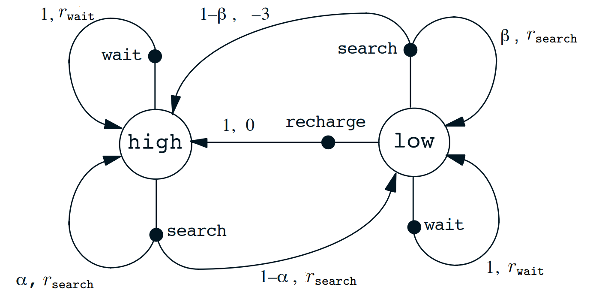

> **Figure 1:** Transaction graph for recycling robot example.

# Value Functions

Having defined the environment dynamics, state-action structure, and reward function, the next step is to formalize the objective of the agent. In reinforcement learning, the goal is to select actions that maximize the cumulative future reward, known as the return $G_t$. However, since the environment is stochastic, this objective must be expressed in expectation.

_Value functions_ provide a formal mechanism for this purpose. They quantify the expected return from a given state (or state-action pair) under a particular policy, thereby linking the dynamics of the environment to the problem of optimal decision-making.

Recall that a policy $\pi$ is a mapping from each state $s \in \mathcal{S}$ and action $a \in \mathcal{A}(s)$ to the probability $\pi(a|s)$ of taking action $a$ when in state $s$. Informally, the _value_ of a state $s$ under a policy $\pi$, denoted $v_\pi(s)$, is the expected return when starting in $s$ and following $\pi$ thereafter. For MDPs, this is formally defined as

$$
\begin{aligned}
v_\pi(s) = \mathbb{E}_\pi [G_t \mid S_t = s] = \mathbb{E}_\pi \left[\sum_{k=0}^{\infty} \gamma^k R_{t+k+1} \,\middle|\, S_t = s \right]
\end{aligned} \tag{8}
$$

where $\mathbb{E}_\pi[\cdot]$ denotes the expected value given that the agent follows policy $\pi$, and $t$ is any time step. Note that the value of a terminal state, if any, is always zero. We call $v_\pi$ the state-value function for policy $\pi$.

Similarly, we define the value of taking action $a$ in state $s$ under a policy $\pi$, denoted $q_\pi(s, a)$, as the expected return starting from $s$, taking action $a$, and thereafter following policy $\pi$:

$$
\begin{aligned}
q_\pi(s, a) = \mathbb{E}_\pi [G_t \mid S_t = s, A_t = a]
= \mathbb{E}_\pi \left[\sum_{k=0}^{\infty} \gamma^k R_{t+k+1} \,\middle|\, S_t = s, A_t = a \right]
\end{aligned} \tag{9}
$$

We call $q_\pi$ the action-value function for policy $\pi$.

A fundamental property of value functions used throughout reinforcement learning and dynamic programming is that they satisfy particular recursive relationships. For any policy $\pi$ and any state $s$, the following consistency condition holds between the value of $s$ and the value of its possible successor states (full derivation in **Section: Bellman Equation Derivation**):

$$
\begin{aligned}
v_{\pi}(s)
= \mathbb{E}_{\pi}[G_t \mid S_t = s]
= \sum_{a} \pi(a \mid s) \sum_{s', r} p(s', r \mid s, a)
\left[r + \gamma v_{\pi}(s')\right]
\end{aligned}\tag{10}
$$

where it is implicit that the actions, $a$, are taken from the set $A(s)$, the next states, $s'$, are taken from the set $\mathcal{S}$ (or from $\mathcal{S}^+$ in the case of an episodic problem), and the rewards, $r$, are taken from the set $\mathcal{R}$. Note also how in the last equation we have merged the two sums, one over all the values of $s'$ and the other over all values of $r$, into one sum over all possible values of both. We will use this kind of merged sum often to simplify formulas. Note how the final expression can be read very easily as an expected value. It is really a sum over all values of the three variables, $a$, $s'$, and $r$. For each triple, we compute its probability, $\pi(a \mid s)p(s', r \mid s, a)$, weight the quantity in brackets by that probability, then sum over all possibilities to get an expected value.

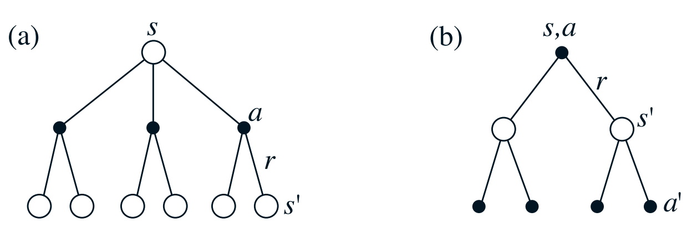

> **Figure 2:** Backup diagrams for (a) $v_\pi$ and (b) $q_\pi$.

_Equation (10)_ is the **Bellman equation** for $v_\pi$, expressing the relationship between a state's value and those of its successor states. As illustrated in _Figure 2a_, starting from state $s$, the agent may take any of several actions, after which the environment responds with a next state $s'$ and reward $r$. The Bellman equation averages over all such possibilities weighted by their probabilities, stating that the value of the start state equals the expected discounted value of the next state plus the expected intermediate reward. The value function $v_\pi$ is the unique solution to this equation, and subsequent chapters show how it forms the basis for computing, approximating, and learning $v_\pi$.

Diagrams like _Figure 2_ are called backup diagrams because they illustrate the update operations central to reinforcement learning, in which value information is transferred back from successor states (or state--action pairs) to the current one. Such diagrams are used throughout the book as graphical summaries of algorithms. Unlike transition graphs, state nodes in backup diagrams need not represent distinct states, and explicit arrowheads are omitted since time always flows downward.

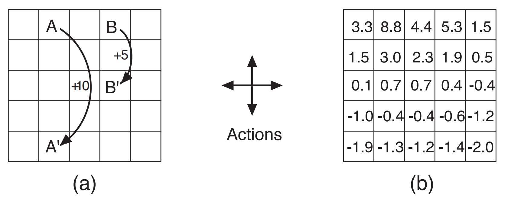

> **Figure 3:** Grid example: (a) exceptional reward dynamics; (b) state-value function for the equiprobable random policy.

**Example 3: Gridworld** _Figure 3a_ shows a rectangular grid MDP where cells are states and four deterministic actions (north, south, east, west) move the agent one cell in the respective direction. Actions that would move the agent off the grid leave it in place with reward $-1$; all other actions yield reward $0$, except from special states $A$ and $B$: all actions from $A$ yield $+10$ and transition to $A'$, and all actions from $B$ yield $+5$ and transition to $B'$.

_Figure 3b_ shows $v_\pi$ for the equiprobable random policy with $\gamma = 0.9$, obtained by solving _Equation (8)_. Negative values near the lower edge reflect the high probability of hitting the grid boundary under the random policy. State $A$ has the highest value yet below $10$, since the agent is sent to $A'$ where boundary penalties are likely. State $B$ is valued above $5$ because $B'$ has positive value, where the chance of reaching $A$ or $B$ more than compensates for potential boundary penalties.

## Bellman Equation Derivation

This is a longer derivation than those presented earlier in the chapter. It is included for completeness and may be skipped on first reading if the goal is only to understand the final form of the value function. The derivation is adapted from [Bellman Derivation](https://stats.stackexchange.com/questions/243384/deriving-bellmans-equation-in-reinforcement-learning).

$$
\begin{aligned}
G_t = \sum_{k=t+1}^{T} \gamma^{k-t-1} R_k
\end{aligned}\tag{11}
$$

is defined earlier in the chapter, with a constant discount factor $0 \le \gamma \le 1$, and we can have $T=\infty$ or $\gamma=1$, but not both. Since the rewards $R_k$ are random variables, so is $G_t$, as it is merely a linear combination of random variables.

$$
\begin{align}
v_\pi(s)
&= \mathbb{E}_\pi[G_t \mid S_t = s] \notag \\
&= \mathbb{E}_\pi[R_{t+1} + \gamma R_{t+2} + \gamma^2 R_{t+3} + \cdots \mid S_t = s] \notag \\
&= \mathbb{E}_\pi[R_{t+1} + \gamma G_{t+1} \mid S_t = s] \notag \\
&= \mathbb{E}_\pi[R_{t+1} \mid S_t = s] + \gamma \mathbb{E}_\pi[G_{t+1} \mid S_t = s]
\end{align} \tag{12}
$$

That last line follows from the linearity of expectation values. $R_{t+1}$ is the reward the agent gains after taking action at time step $t$. For simplicity, assume it can take on a finite number of values $r \in \mathcal{R}$.

Work on the first term. We compute the expectation of $R_{t+1}$ given that we know the current state is $s$:

$$
\begin{aligned}
\mathbb{E}_\pi[R_{t+1} \mid S_t = s] = \sum_{r \in \mathcal{R}} r \, p(r \mid s)
\end{aligned} \tag{13}
$$

This $p(r \mid s)$ is a marginal of a distribution that also contains variables $a$ and $s'$, the action at time $t$ and next state at time $t+1$:

$$
\begin{aligned}
p(r \mid s) = \sum_{s' \in \mathcal{S}} \sum_{a \in \mathcal{A}} p(s', a, r \mid s)
\end{aligned}\tag{14}
$$

Using the chain rule of probability:

$$
\begin{aligned}
p(s', r, a \mid s) = p(s', r \mid a, s)\, p(a \mid s) = p(s', r \mid a, s)\, \pi(a \mid s)
\end{aligned}\tag{15}
$$

We can rewrite $(1)$ using $(2)$ and $(3)$ to:

$$
\begin{aligned}
\mathbb{E}_\pi[R_{t+1} \mid S_t = s] = \sum_{r \in \mathcal{R}} \sum_{s' \in \mathcal{S}} \sum_{a \in \mathcal{A}} r \, \pi(a \mid s) \, p(s', r \mid a, s)
\end{aligned}\tag{16}
$$

On to the **second term**, where $G_{t+1}$ is assumed to take values $g \in \Gamma$:

$$
\begin{aligned}
\mathbb{E}_\pi[G_{t+1} \mid S_t = s] = \sum_{g \in \Gamma} g \, p(g \mid s)
\end{aligned}\tag{17}
$$

Once again, we un-marginalize:

$$
\begin{align}
p(g \mid s)
&= \sum_{r \in \mathcal{R}} \sum_{s' \in \mathcal{S}} \sum_{a \in \mathcal{A}}
p(s', r, a, g \mid s) \\
&= \sum_{r \in \mathcal{R}} \sum_{s' \in \mathcal{S}} \sum_{a \in \mathcal{A}} p(g \mid s', r, a, s)\, p(s', r, a \mid s)  \\
&= \sum_{r \in \mathcal{R}} \sum_{s' \in \mathcal{S}} \sum_{a \in \mathcal{A}}
p(g \mid s', r, a, s)\, p(s', r \mid a, s)\, \pi(a \mid s)  \\
&= \sum_{r \in \mathcal{R}} \sum_{s' \in \mathcal{S}} \sum_{a \in \mathcal{A}}
p(g \mid s')\, p(s', r \mid a, s)\, \pi(a \mid s)
\end{align} \tag{18}
$$

2nd line we use the chain rule on ($s', r, a$). 3rd line we use the chain rule on $a$. The last line follows from the Markov property: future evolution depends only on $s'$, when available.

Thus the second term becomes:

$$
\begin{aligned}
\gamma \mathbb{E}_\pi[G_{t+1} \mid S_t = s] = \gamma \sum_{r \in \mathcal{R}} \sum_{s' \in \mathcal{S}} \sum_{a \in \mathcal{A}} v_\pi(s') \, p(s', r \mid a, s) \, \pi(a \mid s)
\end{aligned}\tag{19}
$$

Combining both terms:

$$
\begin{aligned}
v_{\pi(s)} &= \mathbb{E}_\pi[R_{t+1} \mid S_t = s] + \gamma \mathbb{E}_\pi[G_{t+1} \mid S_t = s] \\
&= \sum_{r \in \mathcal{R}} \sum_{s' \in \mathcal{S}} \sum_{a \in \mathcal{A}} r \, \pi(a \mid s) \, p(s', r \mid a, s) + \gamma \sum_{r \in \mathcal{R}} \sum_{s' \in \mathcal{S}} \sum_{a \in \mathcal{A}} v_\pi(s') \, \pi(a \mid s) \, p(s', r \mid a, s) \\
&= \sum_{r \in \mathcal{R}} \sum_{s' \in \mathcal{S}} \sum_{a \in \mathcal{A}} \pi(a \mid s) \, p(s', r \mid a, s) \big[r + \gamma v_\pi(s')\big] \\
&= \sum_{a \in \mathcal{A}} \pi(a \mid s) \sum_{r \in \mathcal{R}} \sum_{s' \in \mathcal{S}} p(s', r \mid a, s) \, [r + \gamma v_\pi(s')] \\
&= \sum_{a} \pi(a \mid s) \sum_{s', r} p(s', r \mid s, a) \left[r + \gamma v_{\pi}(s')\right]
\end{aligned} \tag{20}
$$

# Optimal Value Function

Solving a reinforcement learning task means, roughly, finding a policy that achieves a lot of reward over the long run. For finite MDPs, we can precisely define an optimal policy in the following way. Value functions define a partial ordering over policies. A policy $\pi$ is defined to be better than or equal to a policy $\pi'$ if its expected return is greater than or equal to that of $\pi'$ for all states. In other words, $\pi \geq \pi'$ if and only if $v_\pi(s) \geq v_{\pi'}(s)$ for all $s \in \mathcal{S}$. There is always at least one policy that is better than or equal to all other policies. This is an optimal policy. Although there may be more than one, we denote all the optimal policies by $\pi^*$. They share the same state-value function, called the optimal state-value function, denoted $v^*$, and defined as

$$
\begin{aligned}
v^*(s) = \max_{\pi} v_\pi(s)
\end{aligned}\tag{21}
$$

for all $s \in \mathcal{S}$.

Optimal policies also share the same optimal action-value function, denoted $q^{\*}$, and defined as:

$$
\begin{aligned}
q^{\*}(s, a) = \max_{\pi} q_\pi(s, a)
\end{aligned}\tag{22}
$$

for all $s \in \mathcal{S}$ and $a \in \mathcal{A}(s)$. For the state–action pair $(s, a)$, this function gives the expected return for taking action $a$ in state $s$ and thereafter following an optimal policy. Thus, we can write $q^{\*}$ in terms of $v^{\*}$ as follows:

$$
\begin{aligned}
q^{\*}(s, a) = \mathbb{E}[R_{t+1} + \gamma v^*(S_{t+1}) \mid S_t = s, A_t = a]
\end{aligned}\tag{23}
$$

Because $v^{\*}$ is the value function for a policy, it must satisfy the self-consistency condition given by the Bellman equation for state values _Equation (10)_. Because it is the optimal value function, however, $v^{\*}$’s consistency condition can be written in a special form without reference to any specific policy. This is the Bellman equation for $v^{\*}$, or the Bellman optimality equation. Intuitively, the Bellman optimality equation expresses the fact that the value of a state under an optimal policy must equal the expected return for the best action from that state:

$$
\begin{align}
v^{\*}(s)
&= \max_{a \in \mathcal{A}(s)} q_{\pi^{\*}}(s, a) \notag \\
&= \max_{a} \mathbb{E}\left[R_{t+1} + \gamma v^{\*}(S_{t+1}) \mid S_t = s, A_t = a \right] \notag \\
&= \max_{a \in \mathcal{A}(s)} \sum_{s' , r} p(s', r \mid s, a)\, \left[ r + \gamma v^{\*}(s') \right]
\end{align}\tag{24}
$$

This follows from the Bellman equation for the value function _Equation (12)_, together with the definition of the optimal value function. In particular, the expectation over actions under a policy is replaced by a maximization over actions, yielding the Bellman optimality equation.

The Bellman optimality equation for $q^{\*}$ is

$$
\begin{align}
q^{\*}(s, a)
&= \mathbb{E}\left[ R_{t+1} + \gamma \max_{a'} q^{\*}(S_{t+1}, a') \mid S_t = s, A_t = a \right] \notag \\
&= \sum_{s', r} p(s', r \mid s, a)\, \left[ r + \gamma \max_{a'} q^{\*}(s', a') \right]
\end{align}\tag{25}
$$

The backup diagrams in _Figure 4_ are identical to those for $v_\pi$ and $q_\pi$, except that arcs at the agent's choice points indicate a maximum is taken rather than an expectation. For finite MDPs, the Bellman optimality equation _Equation (24)_ has a unique solution independent of the policy. It constitutes a system of $N$ equations in $N$ unknowns (one per state), which can in principle be solved for $v^{\*}$ or $q^{\*}$ given the environment dynamics $p(s', r \mid s, a)$.

Given $v^{\*}$, an optimal policy is obtained by assigning nonzero probability only to the actions that achieve the maximum in _Equation (22)_ at each state, i.e., any greedy policy with respect to $v^{\*}$ is optimal. Although greediness normally implies shortsightedness, a greedy policy with respect to $v^{\*}$ is globally optimal because $v^{\*}$ already incorporates the long-term consequences of all future behavior, converting optimal long-term returns into locally available quantities. Thus a one-step search suffices to identify optimal actions.

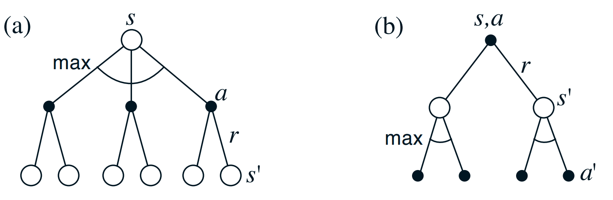

> **Figure 4:** Backup diagrams for (a) $v_*$ and (b) $q_*$

Having $q^{\*}$ simplifies action selection further: the agent need only find any action maximizing $q^{\*}(s, a)$, with no one-step-ahead search required. The action-value function effectively caches all one-step search results, providing optimal long-term returns as immediately available quantities for each state--action pair. This allows optimal actions to be selected without any knowledge of successor states or environment dynamics, at the cost of representing a function over state--action pairs rather than states alone.


# Policy Iteration
We have defined the optimalility equations, but yet we have still not seen how the agent will find the optimal action. This is where policy iteration comes into play. This is one of many different algorithms to find the set best action that we will mention?explain in later chapters. We choose this algorithm because it is very simple and intuitive to understand.

As the name suggests, policy iteration is an iterative procedure that repeatedly applies two simpler operations: **policy evaluation** and **policy improvement**.

_**Policy evaluation**_: computes the value function of the current policy. In other words, assuming the agent continues following the current policy, we estimate the expected return from each state. This step answers the question:

> “How good is the current policy?”

Once these values are known, **_policy improvement_** updates the policy by selecting actions that lead to states with higher expected returns. The policy therefore becomes greedy with respect to the evaluated value function. This step answers the question:

> “Given what we now know about the environment, can we choose better actions?”

These two procedures are alternated repeatedly:

1. Evaluate the current policy.
2. Improve the policy using the computed values.
3. Repeat until the policy no longer changes.

When the policy stabilizes, the algorithm has converged to an optimal policy under the assumptions of the Markov Decision Process.


## Simplified Example Problem
To illustrate policy evaluation and policy iteration, we introduce a simplified Markov Decision Process designed purely for clarity rather than realism. The goal is to isolate the mechanics of the Bellman updates without additional complexity.

The environment consists of three states:

$$
S_1, S_2, S_3
$$

where $S_3$ is the **terminal (goal) state**. Once the agent reaches $S_3$, the process ends; the state is absorbing and no further actions are available.

<p align="center">
  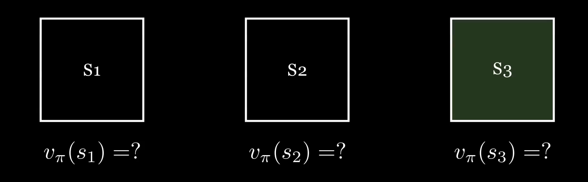
</p>

### Transition structure
* $S_1 \rightarrow {S_1, S_2}$
* $S_2 \rightarrow {S_2, S_3}$
* $S_3$: terminal (no outgoing actions)

All transitions are **deterministic**, meaning each action leads to a single known next state.

### Reward structure
* The agent receives a non-zero reward only when entering the goal state (S_3).

### Simplified Bellman Equation
We assume policy and actions are determenistic, while assuming $\gamma=1$.

$$
\begin{aligned}
v_{\pi}(s)
= \mathbb{E}_{\pi}[G_t \mid S_t = s]
&= \sum_{a} \pi(a \mid s) \sum_{s', r} p(s', r \mid s, a)
\left[r + \gamma v_{\pi}(s')\right] \\
&= r + \gamma v_{\pi}(s')
\end{aligned}
$$

## Example Sequence
At first just like most other ML algorithms we start with a random policy.
<p align="center">
  
</p>

<table>
  <tr>
    <td align="center" width="33%">
      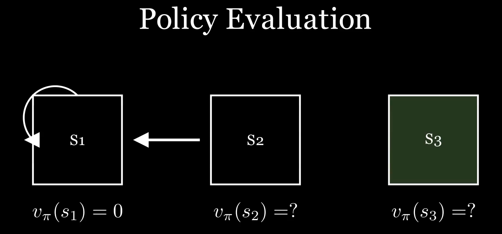<br>
      <sub>1. <b>Compute eq for S₁:</b> r = 0, Vπ(S₂) = 0 (0 if not initialized) -> Vπ(S₁) = 0 </sub>
    </td>
    <td align="center" width="33%">
      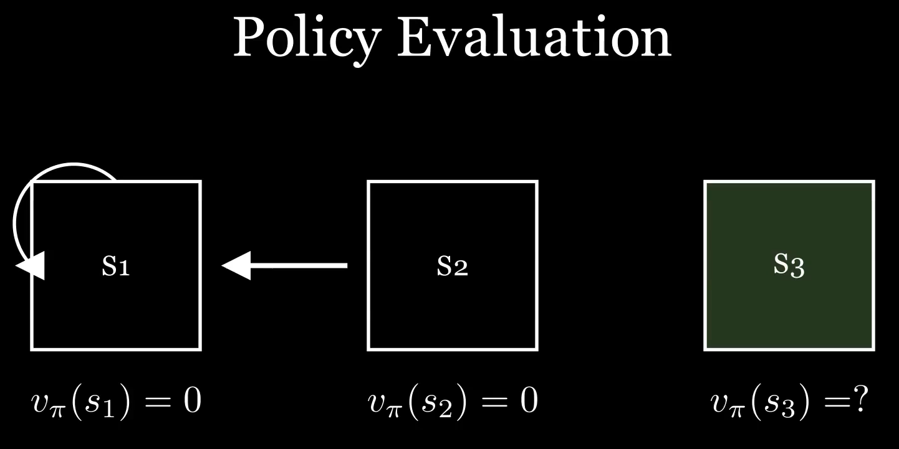<br>
      <sub>2. <b>Compute eq for S₂:</b> r = 0, Vπ(S₂) = 0 (0 if not initialized) -> Vπ(S₁) = 0 </sub>
    </td>
    <td align="center" width="33%">
      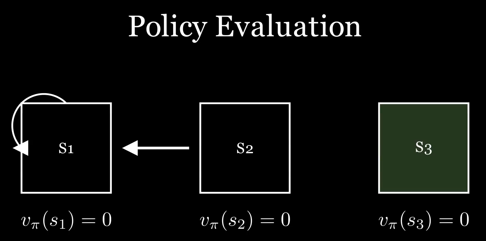<br>
      <sub>3. <b>Compute eq for S₃:</b> Vπ(S₃) = 0 (no actions) </sub>
    </td>
  </tr>

  <tr>
    <td align="center">
      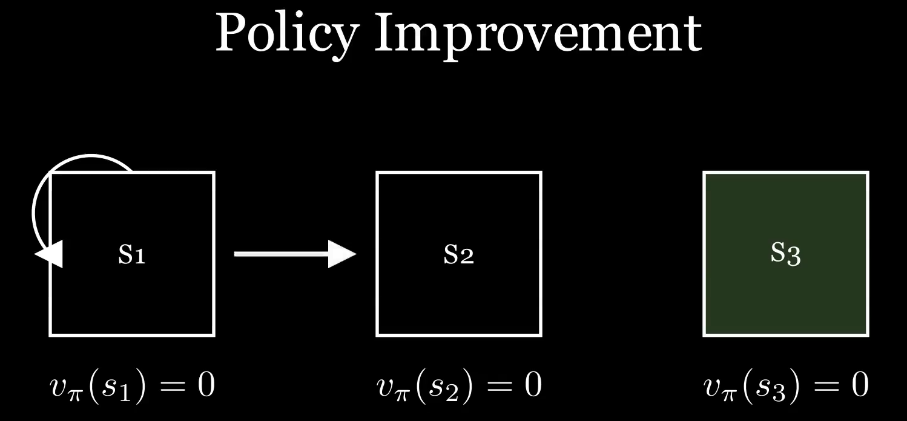<br>
      <sub>4. <b>S₁:</b> Check all possible actions.  </sub>
    </td>
    <td align="center">
      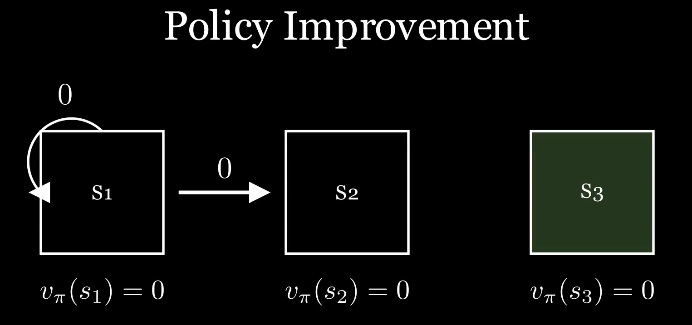<br>
      <sub>5. <b>S₁:</b> No action has a value >0. </sub>
    </td>
    <td align="center">
      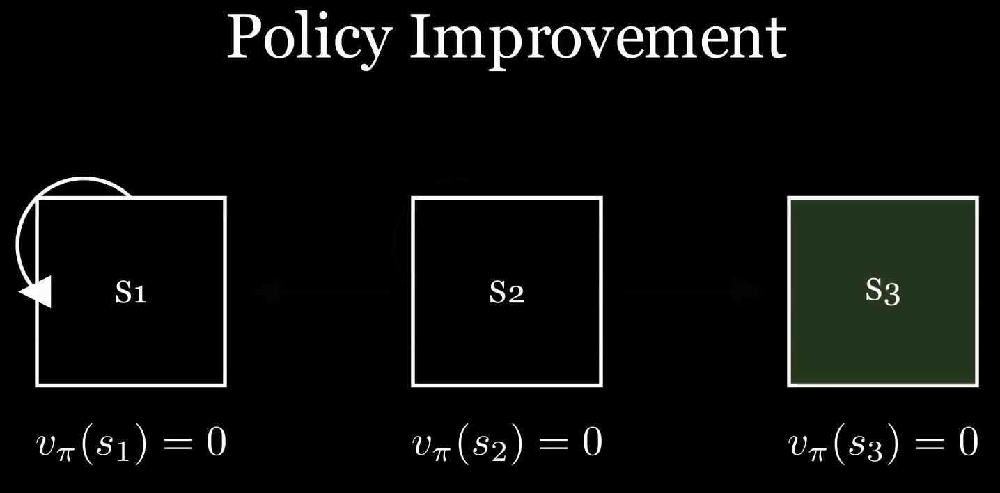<br>
      <sub>6. <b>S₁:</b> So do not change policy (choice of action). </sub>
    </td>
  </tr>

  <tr>
    <td align="center">
      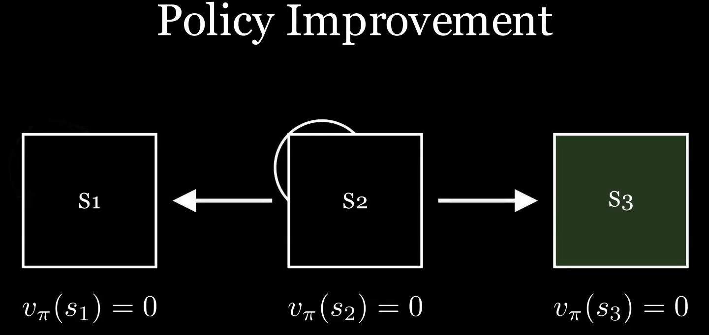<br>
      <sub>7. <b>S₂:</b> Check all possible actions.  </sub>
    </td>
    <td align="center">
      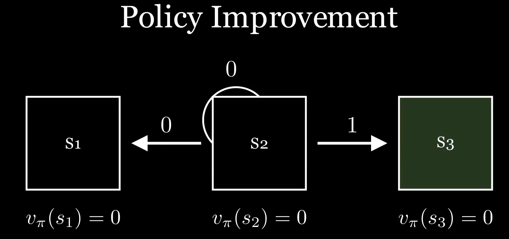<br>
      <sub>8. <b>S₂:</b> Going to the right results in 1 + 0 = 0 due to reward entering S₃, while all other result in 0. </sub>
    </td>
    <td align="center">
      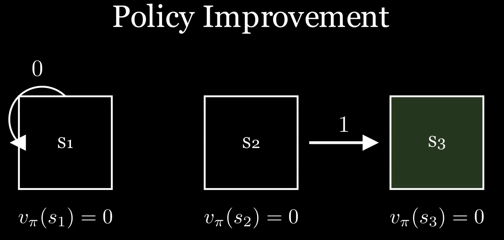<br>
      <sub>9. <b>S₂:</b> So change policy to go to the right (S₃). </sub>
    </td>
  </tr>

  <tr>
    <td align="center">
      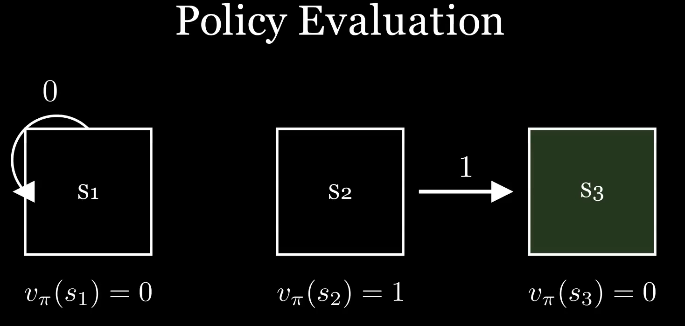<br>
      <sub>10. We update the value function of each state.</sub>
    </td>
    <td align="center">
      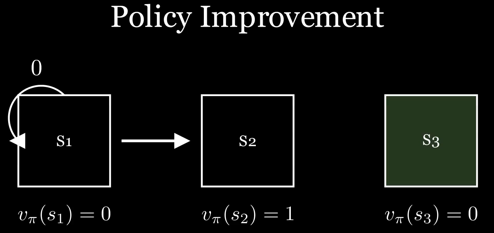<br>
      <sub>11. <b>S₁:</b> Check all possible actions.  </sub>
    </td>
    <td align="center">
      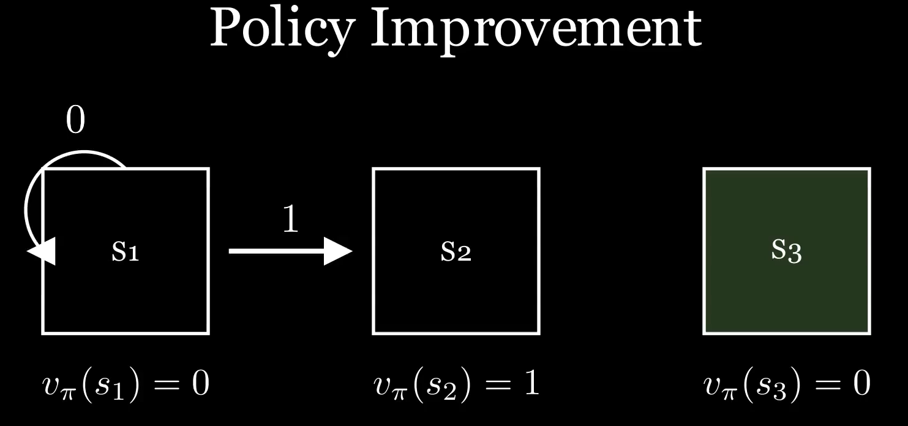<br>
      <sub>12. <b>S₁:</b> Going to the right (S₂) result in 0+1=1, while the other actions result in 0. </sub>
    </td>
  </tr>

  <tr>
    <td align="center">
      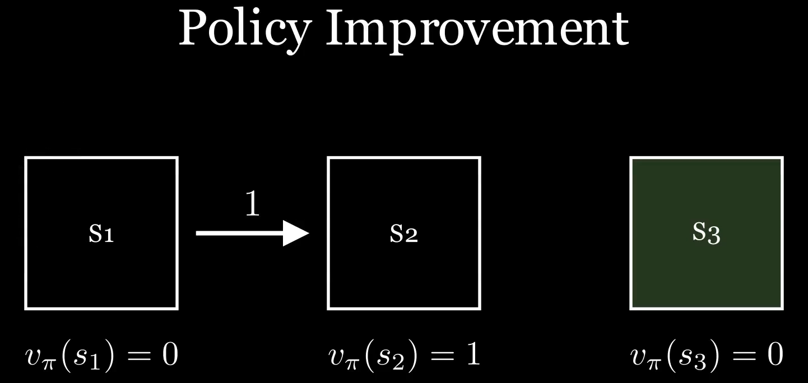<br>
      <sub>13. <b>S₁:</b> So we update the policy to choose going to the right (S₂).</sub>
    </td>
    <td align="center">
      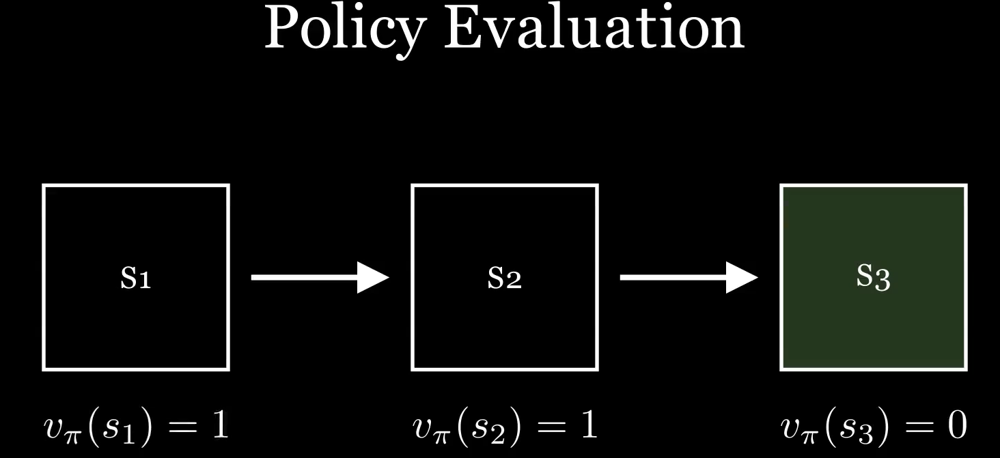<br>
      <sub>14. We compute the value function with the updated policy. This results in the optimal policy at every state.</sub>
    </td>
  </tr>
</table>


# Summary

Let us summarize the elements of the reinforcement learning problem that we have presented in this chapter. Reinforcement learning is about learning from interaction how to behave in order to achieve a goal. The reinforcement learning agent and its environment interact over a sequence of discrete time steps. The specification of their interface defines a particular task: the actions are the choices made by the agent; the states are the basis for making the
choices; and the rewards are the basis for evaluating the choices. Everything inside the agent is completely known and controllable by the agent; everything outside is incompletely controllable but may or may not be completely known. A policy is a stochastic rule by which the agent selects actions as a function of states. The agent’s objective is to maximize the amount of reward it receives over time.

The return is the function of future rewards that the agent seeks to maximize. It has several different definitions depending upon the nature of the task and whether one wishes to discount delayed reward. The undiscounted formulation is appropriate for episodic tasks, in which the agent–environment interaction breaks naturally into episodes; the discounted formulation is appropriate for continuing tasks, in which the interaction does not naturally break into episodes but continues without limit.

An environment satisfies the Markov property if its state signal compactly summarizes the past without degrading the ability to predict the future. This is rarely exactly true, but often nearly so; the state signal should be chosen or constructed so that the Markov property holds as nearly as possible. In this book we assume that this has already been done and focus on the decision making problem: how to decide what to do as a function of whatever state signal is available. If the Markov property does hold, then the environment is called a Markov decision process (MDP). A finite MDP is an MDP with finite state and action sets. Most of the current theory of reinforcement learning is restricted to finite MDPs, but the methods and ideas apply more generally.

A policy’s value functions assign to each state, or state–action pair, the expected return from that state, or state–action pair, given that the agent uses the policy. The optimal value functions assign to each state, or state–action pair, the largest expected return achievable by any policy. A policy whose value functions are optimal is an optimal policy. Whereas the optimal value functions for states and state–action pairs are unique for a given MDP, there can be many optimal policies. Any policy that is greedy with respect to the optimal value functions must be an optimal policy. The Bellman optimality equations are special consistency condition that the optimal value functions must satisfy and that can, in principle, be solved for the optimal value functions, from which an optimal policy can be determined with relative ease.

A reinforcement learning problem can be posed in a variety of different ways depending on assumptions about the level of knowledge initially available to the agent. In problems of complete knowledge, the agent has a complete and accurate model of the environment’s dynamics. If the environment is an MDP, then such a model consists of the one-step transition probabilities and expected rewards for all states and their allowable actions. In problems of incomplete knowledge, a complete and perfect model of the environment is not available.

Even if the agent has a complete and accurate environment model, the agent is typically unable to perform enough computation per time step to fully use it. The memory available is also an important constraint. Memory may be required to build up accurate approximations of value functions, policies, and models. In most cases of practical interest there are far more states than
could possibly be entries in a table, and approximations must be made.

A well-defined notion of optimality organizes the approach to learning we describe in this book and provides a way to understand the theoretical properties of various learning algorithms, but it is an ideal that reinforcement learning agents can only approximate to varying degrees. In reinforcement learning we are very much concerned with cases in which optimal solutions cannot be found but must be approximated in some way.

# References

- Sutton, Richard S., and Andrew G. Barto. *Reinforcement Learning: An Introduction*. 2nd ed. MIT Press, 2018. Available at: https://web.stanford.edu/class/psych209/Readings/SuttonBartoIPRLBook2ndEd.pdf

- Thomas, Garrett. “A Survey of Model-Based Reinforcement Learning.” 2020. Available at: https://arxiv.org/abs/2006.16712

- “Deriving Bellman’s Equation in Reinforcement Learning.” *Cross Validated (Stack Exchange)*, 2016. Available at: https://stats.stackexchange.com/questions/243384/deriving-bellmans-equation-in-reinforcement-learning

- Bwhiz. “Deriving the Bellman Equation for the Value Function.” *Medium*, 2017. Available at: https://medium.com/@Bwhiz/deriving-the-bellman-equation-for-the-value-function-594be80bfeb4

- 3Blue1Brown. “3Blue1Brown YouTube Channel.” Accessed 2026. Available at: https://www.youtube.com/@3blue1brown

- StatQuest with Josh Starmer. “StatQuest YouTube Channel.” Accessed 2026. Available at: https://www.youtube.com/@statquest

- Gormley, Matthew. “Reinforcement Learning / Markov Decision Processes Lecture Notes.” 2017. Available at: https://www.cs.cmu.edu/~mgormley/courses/10601-s17/slides/lecture26-ri.pdf

# Citing
To cite this chapter, please use the following bibtex

```bibtex
@misc{Adham2026ReinforcementLearning,
  author       = {Adam Adham},
  title        = {Reinforcement Learning: A Gentle Introduction, Chapter 2 (Part 2): Finite Markov Decision Processes},
  year         = {2026},
  publisher    = {GitHub},
  howpublished = {\url{https://github.com/amrmsab/reinforcement_learning_book}},
}
```
