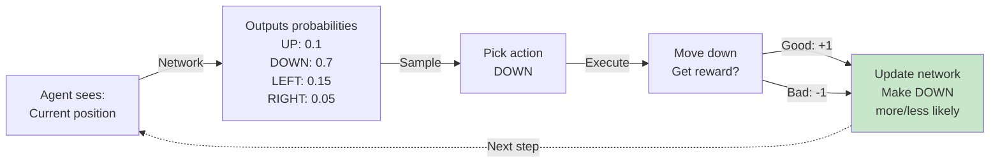
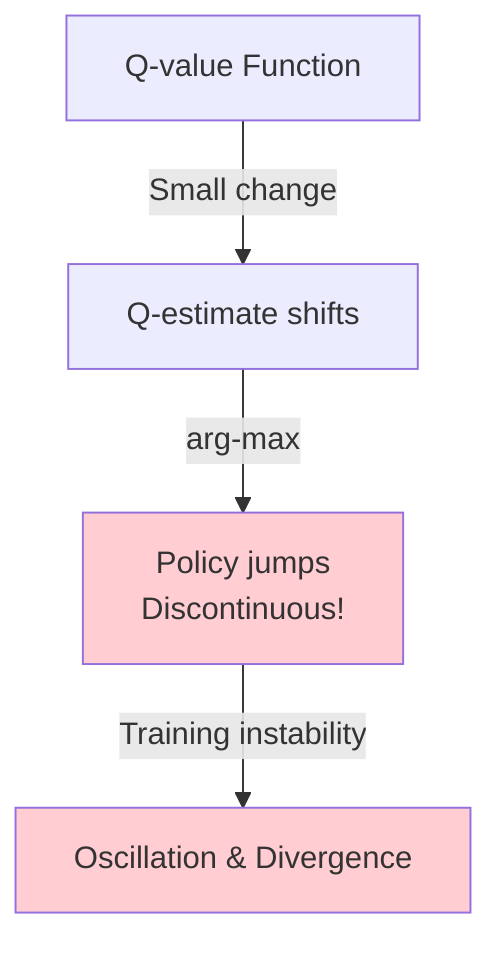
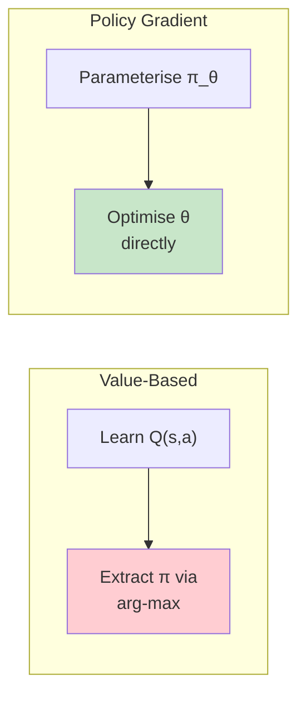
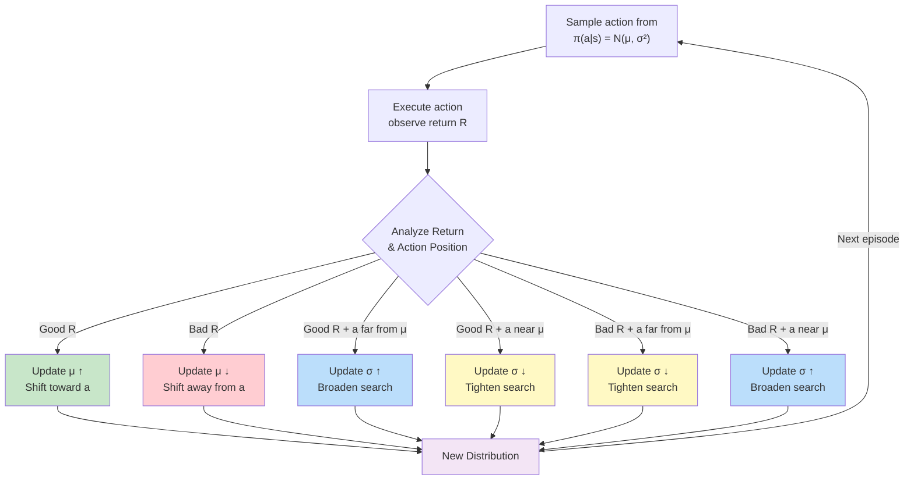
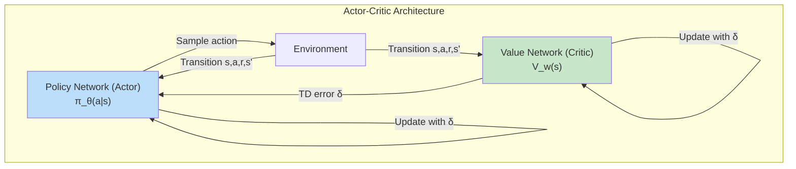
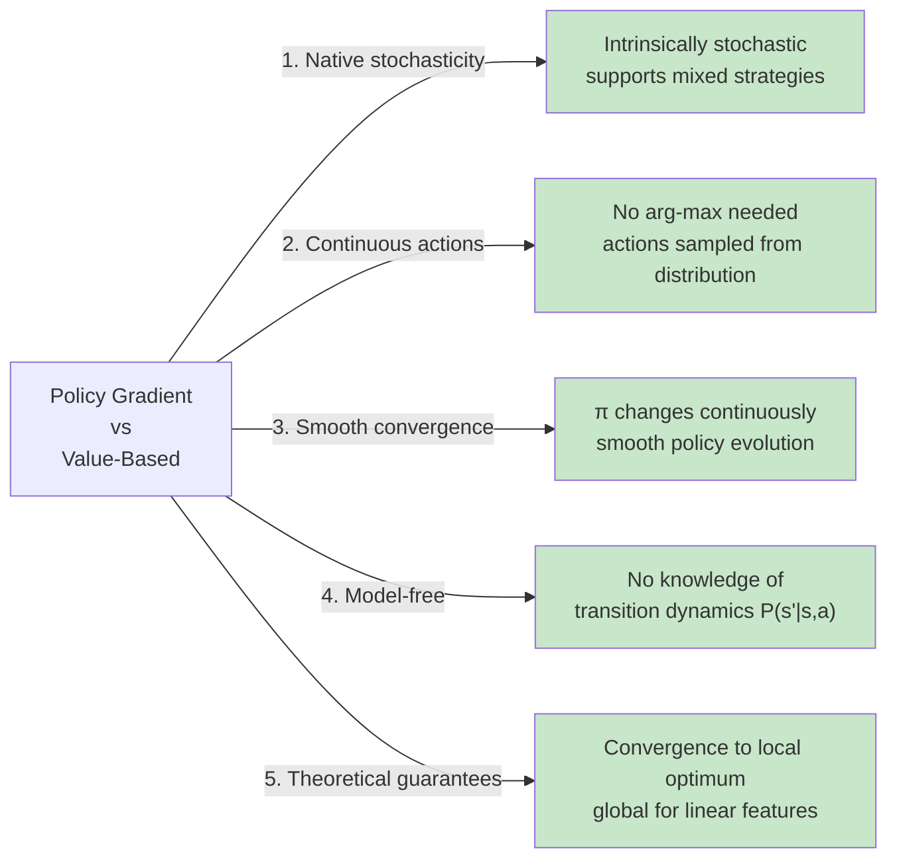

# Policy Gradient Methods: Learning to Act, Not to Judge

**by [Ahmed Abolfadl](https://www.linkedin.com/in/ahmed-abolfadl-bb640624b/)**

> Instead of learning which actions are _valuable_, why not learn the actions themselves? That's what policy gradient methods do. They directly optimize the **policy**—the agent's decision-making strategy—by following the gradient of expected return.

## Quick Overview

We're going to explore **policy gradient methods**—algorithms that let AI agents learn to make good decisions through trial and error.

**What you'll learn:**

- Why directly learning actions is sometimes better than learning their values
- The magic behind the Policy Gradient Theorem
- The REINFORCE algorithm
- REINFORCE Variants
- Actor-Critic methods quick overview

**Prerequisites:** Basic knowledge of neural networks, supervised learning, and probability. Don't worry if you're rusty on calculus—we'll build intuition first, then show the math.

---

## Introduction: A Different Way to Learn

Think about how a basketball player learns to shoot. They don't start by memorizing the value of every possible angle and distance combination. Instead, they try different shots, notice what works, and gradually adjust their technique. **That's policy gradient learning.**

Here are more familiar examples:

- **A chef refining a recipe:** Instead of rating every possible ingredient combination, the chef tries variations, tastes the results, and adjusts the amounts of salt, spice, or heat based on feedback.
- **A salesperson's pitch:** Rather than analyzing the "value" of every sentence, they try different approaches with clients, notice which ones resonate, and naturally shift toward what works.
- **Learning to parallel park:** You don't calculate the exact steering angle needed; you try, feel the feedback, and adjust until it works.

Most RL algorithms you've heard of in the previous chapters (like Q-learning) work backwards:

1. Learn the _value_ of each action (Is this shot worth taking?)
2. Pick the highest-value action
3. Repeat

Policy gradient methods are direct and intuitive—they match how humans actually learn:

1. Have a policy (shooting technique) parameterized by a neural network
2. Try actions based on that policy
3. If you get reward, increase the probability of similar actions
4. If you fail, decrease it
5. Repeat

This chapter will show you exactly how this works, why it's elegant, and how to implement it.

### A Thought Experiment: Learning in a Maze

Imagine an agent in a maze with a policy parameterized by a neural network $\pi_{{\theta}}$. The network takes the current position and outputs probabilities for each direction (up, down, left, right).

The agent doesn't think "how much is going left worth?" Instead, it just **tries actions** and learns. If a path works—leads to the goal—the network updates its parameters to make that action more likely next time.



This is the essence. The gradient tells us how to nudge the network parameters to make good actions more likely.

---

## Part 1: The Basics (You've Seen This Before)

Before we dive into policy gradients, let's quickly review the pieces that make up reinforcement learning. If you've taken a basic RL course, this should feel familiar.

### What's an MDP? (The Problem Setup)

A **Markov Decision Process** is just a formal way of describing an agent-environment loop:

$$\mathcal{M}=(\mathcal{S}, \mathcal{A}, P, r, \gamma)$$

Let me break this down in plain English:

- **$\mathcal{S}$** = All possible situations the agent could be in (like "I'm at this position in the maze")
- **$\mathcal{A}$** = All actions the agent can take (up, down, left, right)
- **$P(s' \mid s,a)$** = The environment's rules. If I'm in state $s$ and take action $a$, what's the probability I end up in state $s'$?
- **$r(s,a)$** = Reward for taking action $a$ in state $s$ (how much reward do I get?)
- **$\gamma$** = A discount factor between 0 and 1. It means we care more about immediate rewards than distant ones

That's it. Most of RL is just figuring out what to do in this setup.

### The Policy: "Here's My Plan"

A **policy** is your agent's decision-making rule. It says: "In this situation, here's the probability I'll take each action."

In policy gradient methods, we use a neural network to represent the policy:

$$\pi_{{\theta}}(a \mid s) = \text{P(choose action } a \text{ in state } s \text{)}$$

where $\theta$ are the network's weights.

For discrete actions (like moving in 4 directions), we typically use **softmax** at the output layer:

```
Input: [position info]
  ↓
Network layers: [dense → ReLU → dense → ...]
  ↓
Logits: [0.5, -0.3, 1.2, -0.1]  (raw scores)
  ↓
Softmax: [0.25, 0.15, 0.45, 0.15]  (probabilities)
  ↓
Action: Pick direction with probability proportional to these numbers
```

The key constraint: **all probabilities must sum to 1** (because we have to choose something).

$$\sum_{a} \pi_{{\theta}}(a \mid s) = 1$$

### Value Functions: The "Are We Winning?" Perspective

Now, there are different ways to measure how good things are:

**Q-value** $Q^{\pi}(s,a)$: "If I'm in state $s$ and take action $a$, how much total reward do I expect?"

$$Q^{\pi}(s,a) = \mathbb{E}[\text{all future rewards from taking } a \text{ in } s]$$

**V-value** $V^{\pi}(s)$: "If I'm in state $s$ and I follow my policy, how much total reward do I expect?"

$$V^{\pi}(s) = \text{Expected reward if I start here and act optimally}$$

**Advantage** $A^{\pi}(s,a)$: "Was that action better or worse than my average?"

$$A^{\pi}(s,a) = Q^{\pi}(s,a) - V^{\pi}(s)$$

Think of it this way:

- If $A^{\pi}(s,a) > 0$: This action was better than usual—reinforce it
- If $A^{\pi}(s,a) < 0$: This action was worse than usual—avoid it
- If $A^{\pi}(s,a) \approx 0$: This action was about average—don't change much

### One Important Insight: Why Our Data Isn't Random

Here's something that trips people up in RL: **In supervised learning, your training data is fixed.** In RL, your training data _depends on your current policy._

Think about it: if your policy changes, which situations will you encounter? Different ones! This makes RL tricky—you're changing both the rule AND the examples you learn from. But it's also powerful—you get to explore intelligently.

---

## Part 2: Limitations of Value-Based Methods

Classical _action-value methods_ (Q-learning) operate by learning an approximation $Q(s,a) \approx Q^{*}(s,a)$ and then extracting the policy implicitly:

$$\pi(s) = \arg\max_{a}\, Q(s, a)$$

Despite empirical success, this approach suffers from **three fundamental drawbacks**:

### 1. Determinism

The greedy policy is always _deterministic_: a single action $a^{*}$ is always selected.

**Problem:** In many real-world settings—such as adversarial games, partially observable environments, or tasks requiring sophisticated exploration—a _stochastic_ policy is **provably optimal**.

**Examples:**

- **Rock-Paper-Scissors:** The only Nash equilibrium is the uniform random policy $\pi(r)=\pi(p)=\pi(s)=1/3$. A deterministic policy can always be exploited. (Always throwing rock? Your opponent learns to throw paper 100% of the time.)

- **Poker:** A winning strategy is inherently randomized. If you always bluff with certain hand types, skilled opponents fold to your bluffs too often.

- **Incomplete information environments:** In real-world tasks with hidden state, being unpredictable is an advantage. A deterministic route for a delivery robot is vulnerable to ambush. A randomized route is safer.

**Workaround:** $\varepsilon$-greedy exploration is applied only during training and discarded at deployment, meaning the learned policy is suboptimal at test time.

### 2. Non-Smooth Convergence

Because the policy is extracted through an $\arg\max$ operation, a **tiny change in Q-values can cause a discontinuous switch** in the selected action.

**Problem:** The training landscape becomes non-smooth, leading to oscillation and instability, especially when Q-values are approximated by a neural network.

**Real-world analogy:** Imagine a robot learning to decide between two paths:

- Path A estimated value: 5.0
- Path B estimated value: 4.9
- Robot always takes Path A

Then training updates slightly:

- Path A value: 4.99
- Path B value: 5.01
- Robot **completely switches** to Path B

But the true value difference is negligible! The robot oscillates wildly between paths as Q-values shuffle by tiny amounts. In contrast, a stochastic policy would gradually shift from 51% A, 49% B → 49% A, 51% B smoothly.



### 3. Inapplicability to Continuous Action Spaces

The $\arg\max$ operation requires enumeration of all actions:

$$a^* = \arg\max_{a} Q(s, a)$$

**Problem:** When the action space is continuous (e.g., steering angle, robot joint torque), maximization becomes a hard optimization problem that is expensive to solve at every step.

**Real-world challenge:**

Consider a robotic arm learning to grasp:

- **Discrete approach (impossible):** "Choose one of ∞ possible finger positions" — can't enumerate infinity
- **Quantized workaround:** Discretize to 100 positions per finger × 6 fingers = 10^12 possible states. At 1000 per second, evaluating all takes centuries.
- **What policy gradients do:** Network directly outputs "apply 2.5 N to finger 1, 3.1 N to finger 2..." in one forward pass

**Why this matters:** Many real-world control problems have continuous action spaces:

- **Autonomous vehicles:** Steering angle, acceleration (infinite precision)
- **Robotic manipulation:** Joint torques, end-effector position (high dimensional)
- **Power systems:** Voltage regulation, reactive power (continuous)
- **Drug dosing:** Exact dose amounts (not discrete buckets)

### Motivation: Why Optimize the Policy Directly?

If our ultimate objective is a good policy $\pi$, why do we optimise an intermediate quantity $Q$ at all?

**Answer:** Policy gradient methods dispense with the value function as the primary optimisation target and instead **parameterise and maximise the policy directly**.



---

## Part 3: Policy Gradient Framework

### Core Idea: Direct Policy Parameterization

In the policy gradient framework, the policy is represented by a _parameterised_ function:

$$\pi_{{\theta}}(a \mid s) = \Pr(A_t = a \mid S_t = s;\; {\theta})$$

where ${\theta} \in \mathbb{R}^{d}$ is a vector of learnable parameters.

### Neural Network Implementation

In modern practice, $\pi_{{\theta}}$ is implemented as a _neural network_ whose output layer is passed through a **softmax** function (for discrete actions):

$$\pi_{{\theta}}(a_i \mid s) = \frac{e^{\theta(s,\, a_i)}}{\sum_{j} e^{\theta(s,\, a_j)}}$$

where $\theta(s, a)$ denotes the logit (pre-softmax score).

### Learning Loop

The complete learning cycle is:


**Step-by-step:**

1. Current state $s$ is fed into the neural network
2. Network outputs a probability distribution $(\Pr(A_1),\, \Pr(A_2),\, \ldots,\, \Pr(A_n))$
3. An action is _sampled_ from this distribution
4. Action is executed in environment, returning a reward
5. Policy performance is evaluated
6. Network parameters ${\theta}$ are updated to make high-reward actions more probable

**Key advantage:** This framework supports _stochastic_ policies **by design**. Exploration is intrinsic to the policy, not a hand-crafted add-on.

---

## Part 4: The Policy Gradient Theorem

### Performance Objective

Let $\tau = (s_0, a_0, s_1, a_1, \ldots, s_T)$ denote a _trajectory_ (complete episode). The cumulative discounted return is:

$$R(\tau) = \sum_{t=0}^{T} \gamma^{t}\, r_t$$

We define the **policy performance objective** as the expected return over trajectories sampled under the current policy:

$$\boxed{J({\theta}) = \mathbb{E}_{\tau \sim \pi_{{\theta}}}\!\bigl[R(\tau)\bigr]}$$

Our goal is to find ${\theta}^{*} = \arg\max_{{\theta}}\, J({\theta})$.

### Gradient Ascent vs. Descent

Classical supervised learning minimises a loss via _gradient descent_:

$${\theta}_{t+1} = {\theta}_t - \alpha\, \nabla_{{\theta}}\, \mathcal{L}({\theta})$$

In reinforcement learning, there is no "true value" to compare against—only rewards and penalties. We wish to _maximise_ $J({\theta})$, so we use _gradient ascent_:

$${\theta}_{t+1} = {\theta}_t + \alpha\, \nabla_{{\theta}}\, J({\theta})$$

The update moves ${\theta}$ in the direction of **steepest increase** of the objective.

### Derivation: Score Function Estimator

Let $x\sim p_\theta(x)$ and let $f(x)$ be any integrable test function. Define:

$$F(\theta) = \int p_\theta(x) f(x)\, dx$$

Under mild regularity conditions (dominated convergence), differentiation under the integral is valid:

$$\nabla_\theta F(\theta) = \int \nabla_\theta p_\theta(x) f(x)\, dx$$

Using the **log-derivative trick**:

$$\nabla_\theta p_\theta(x) = p_\theta(x)\,\nabla_\theta\log p_\theta(x)$$

We obtain:

$$\nabla_\theta F(\theta) = \mathbb{E}_{x\sim p_\theta}\!\left[f(x)\,\nabla_\theta\log p_\theta(x)\right]$$

This is the _Score Function Estimator_ (likelihood-ratio trick). Policy gradients follow by setting $x\equiv\tau$ and $f(\tau)\equiv R(\tau)$.

### Plain Language Intuition

Suppose two trajectories $\tau^{(1)}$ and $\tau^{(2)}$ are sampled:

- If $R(\tau^{(1)}) > R(\tau^{(2)})$, the score estimator:
  - **Increases** parameters along directions that make $\tau^{(1)}$ more probable
  - **Decreases** parameters that make $\tau^{(2)}$ more probable

**Operational essence:**

$$\text{"increase log-likelihood of high-return samples; decrease that of low-return samples."}$$

The term $\nabla_\theta\log p_\theta(x)$ points in the direction that makes sample $x$ more likely. Multiplying by $f(x)$ means we **upweight** directions associated with high utility and **downweight** directions associated with low utility.

### Full Derivation Steps

**Step i — Rewrite objective as integral:**

$$J({\theta}) = \int P(\tau \mid {\theta})\, R(\tau)\, d\tau$$

where $P(\tau \mid {\theta})$ is the probability density of trajectory $\tau$ under policy $\pi_{{\theta}}$.

**Step ii — Differentiate under integral:**

$$\nabla_{{\theta}}\, J({\theta}) = \int \nabla_{{\theta}}\, P(\tau \mid {\theta})\, R(\tau)\, d\tau$$

**Step iii — Apply log-derivative trick:**

$$\nabla_{{\theta}}\, P(\tau \mid {\theta}) = P(\tau \mid {\theta})\; \nabla_{{\theta}}\log P(\tau \mid {\theta})$$

$$\nabla_{{\theta}}\, J({\theta}) = \int P(\tau \mid {\theta})\; \nabla_{{\theta}}\log P(\tau \mid {\theta})\; R(\tau)\, d\tau$$

**Step iv — Factorise trajectory probability:**

Using the **chain rule of probability** (Markov assumption):

$$P(\tau \mid {\theta}) = \rho(s_0) \prod_{t=0}^{T} \pi_{{\theta}}(a_t \mid s_t)\; P(s_{t+1} \mid s_t, a_t)$$

where $\rho(s_0)$ is the initial state distribution and $P(s_{t+1} \mid s_t, a_t)$ is the environment's unknown dynamics.

**Step v — Take logarithm:**

$$\log P(\tau \mid {\theta}) = \log\rho(s_0) + \sum_{t=0}^{T}\log\pi_{{\theta}}(a_t \mid s_t) + \sum_{t=0}^{T}\log P(s_{t+1} \mid s_t, a_t)$$

**Step vi — Eliminate environment-dependent terms:**

Differentiating with respect to ${\theta}$:

- Neither $\log\rho(s_0)$ nor $\log P(s_{t+1} \mid s_t, a_t)$ depend on ${\theta}$
- Their gradients vanish

Therefore:

$$\nabla_{{\theta}}\log P(\tau \mid {\theta}) = \sum_{t=0}^{T} \nabla_{{\theta}}\log\pi_{{\theta}}(a_t \mid s_t)$$

**This is profound:** The gradient depends _only_ on the policy, not on transition dynamics. **Policy gradient methods are model-free.**

### The Policy Gradient Theorem

**Theorem:** For a differentiable, parameterised policy $\pi_{{\theta}}$ with performance objective $J({\theta}) = \mathbb{E}_{\tau \sim \pi_{{\theta}}}[R(\tau)]$:

$$\boxed{\nabla_{{\theta}}\, J({\theta}) = \mathbb{E}_{\tau \sim \pi_{{\theta}}}\!\left[\sum_{t=0}^{T} \nabla_{{\theta}}\log\pi_{{\theta}}(a_t \mid s_t)\; R(\tau)\right]}$$

**Interpretation:** The gradient is an expectation, so it can be _estimated_ by Monte Carlo sampling—by running the policy in the environment and collecting trajectories. **No knowledge of the transition dynamics is needed.**

### State-Action Form

An equivalent and often more useful form conditions on individual state-action pairs:

**Theorem:** For a differentiable policy $\pi_{{\theta}}$ in a discounted MDP:

$$\boxed{\nabla_{{\theta}}J({\theta}) = \frac{1}{1-\gamma} \mathbb{E}_{s\sim d_{\pi_{{\theta}}},\,a\sim\pi_{{\theta}}} \left[\nabla_{{\theta}}\log\pi_{{\theta}}(a\mid s)\,Q^{\pi_{{\theta}}}(s,a)\right]}$$

This reveals the **algorithmic template** shared by REINFORCE, Actor-Critic, TRPO, and PPO: estimate a policy score term $\nabla\log\pi$ and weight it by a measure of action quality $Q^{\pi}(s,a)$.

---

## Part 5: REINFORCE Algorithm

### Improving the Gradient Estimate

The Policy Gradient Theorem weights every action's gradient by the _total_ trajectory return $R(\tau) = r_0 + r_1 + \cdots + r_T$.

**Problem:** An action taken at time $t$ cannot causally influence rewards received **before** $t$. Using the full trajectory return introduces unnecessary variance.

**Solution:** Replace $R(\tau)$ with the _return-from-t_:

$$G_t = r_t + r_{t+1} + \cdots + r_T = \sum_{k=t}^{T} r_k$$

This yields a **lower-variance, unbiased estimator**, and solves the **credit assignment** problem:

$$\nabla_{{\theta}}\, J({\theta}) \approx \mathbb{E}_{\tau \sim \pi_{{\theta}}}\!\left[\sum_{t=0}^{T} \nabla_{{\theta}}\log\pi_{{\theta}}(a_t \mid s_t)\; G_t\right]$$

**Key intuition:**

| Condition                                  | Update                                       |
| ------------------------------------------ | -------------------------------------------- |
| $G_t > 0$ (profitable trajectory from $t$) | **Increase** log-probability of action $a_t$ |
| $G_t < 0$ (costly trajectory from $t$)     | **Decrease** log-probability of action $a_t$ |
| Large $\|G_t\|$                            | Large credit signal for credit assignment    |

**Real-world intuition:**

Think of REINFORCE like reviewing a completed project:

- **Good outcome (G_t > 0):** You look back and think "we made good decisions at step t (when we chose action a_t), let's do that again next time."
- **Bad outcome (G_t < 0):** You realize "that decision at step t was a mistake; we should avoid it."
- **Strong signal (|G_t| large):** A huge success or massive failure sends a clear message about what to repeat or avoid.

**Example: Learning to write essays**

- Episode: student writes an essay and gets feedback
- Good paragraph early in essay (G_t > 0 from that point): Reinforce that writing style, structure
- Weak argument midway (G_t < 0): Reduce probability of that argumentative approach
- Poor conclusion tanks the grade: Large negative signal (G_t < 0) strongly adjusts against that conclusion structure

### REINFORCE Update Rule

Combining gradient ascent with the improved estimator:

$${\theta}_{t+1} = {\theta}_t + \alpha \sum_{t'=0}^{T} \nabla_{{\theta}}\log\pi_{{\theta}}(a_{t'} \mid s_{t'})\cdot G_{t'}$$

where the sum is taken over all time steps of the collected episode.

### Algorithm Pseudocode

```
REINFORCE (Monte-Carlo Policy Gradient)
───────────────────────────────────────

Input:
  α      : Learning rate
  γ      : Discount factor
  π_θ    : Policy network

Initialize θ randomly

Repeat (for each episode):
  Sample full episode: τ = (s_0, a_0, r_0, ..., s_T)

  Initialize return G = 0
  For t = T down to 0:  # Compute returns backward
    G ← r_t + γ·G
    θ ← θ + α·∇_θ log π_θ(a_t | s_t)·G

Until convergence
```

### Worked Example

Consider a two-state, two-action MDP with reward function:

$$R(s_0, a_0) = +2, \quad R(s_0, a_1) = -1, \quad R(s_1, a_0) = +1, \quad R(s_1, a_1) = -1$$

**Initial Setup:**

- Policy parameters: ${\theta} = [0.5,\; -0.5,\; 0.1,\; 0.3]^{\top}$
- Learning rate: $\alpha = 0.1$
- Policy uses softmax parameterisation

**For softmax, the score function has closed form:**

$$\frac{\partial \log\pi(a \mid s)}{\partial \theta(s,\, a)} = 1 - \pi(a \mid s)$$
$$\frac{\partial \log\pi(a \mid s)}{\partial \theta(s,\, a')} = -\pi(a' \mid s)$$

#### Episode 1

**Trajectory:** $\tau_1 = (s_0,\, a_0,\, r=+2) \to (s_1,\, a_0,\, r=+1) \to \text{terminate}$

**Initial probabilities:**
$$\pi(a_0 \mid s_0) = 0.73, \quad \pi(a_1 \mid s_0) = 0.27$$
$$\pi(a_0 \mid s_1) = 0.45, \quad \pi(a_1 \mid s_1) = 0.55$$

**Compute returns:** $G_0 = 2 + 1 = 3$, $G_1 = 1$

**Gradient estimate:**
$$\hat{g} = 3\begin{bmatrix}0.27\\-0.27\\0\\0\end{bmatrix} + 1\begin{bmatrix}0\\0\\0.55\\-0.55\end{bmatrix} = \begin{bmatrix}0.81\\-0.81\\0.55\\-0.55\end{bmatrix}$$

**Parameter update:**
$${\theta} \leftarrow \begin{bmatrix}0.5\\-0.5\\0.1\\0.3\end{bmatrix} + 0.1 \times \begin{bmatrix}0.81\\-0.81\\0.55\\-0.55\end{bmatrix} = \begin{bmatrix}0.58\\-0.58\\0.16\\0.25\end{bmatrix}$$

#### Episode 2

**Trajectory:** $\tau_2 = (s_0,\, a_1,\, r=-1) \to (s_1,\, a_1,\, r=-1) \to \text{terminate}$

**Updated probabilities:**
$$\pi(a_0 \mid s_0) = 0.76,\quad \pi(a_1 \mid s_0) = 0.24$$
$$\pi(a_0 \mid s_1) = 0.48,\quad \pi(a_1 \mid s_1) = 0.52$$

Note: $\pi(a_0 \mid s_0)$ has increased from $0.73 \to 0.76$ ✓

**Returns:** $G_0 = -2$, $G_1 = -1$

**Gradient with sign analysis:**

At $t=0$, agent chose bad action $a_1$. The score component for $\theta(s_0, a_1)$ is positive ($+0.76$). Multiplying by negative return $G_0 = -2$ yields $-1.52$—a **negative update** that **decreases** the probability of choosing $a_1$. ✓

**Updated parameters:**
$${\theta} \leftarrow \begin{bmatrix}0.73\\-0.73\\0.203\\0.197\end{bmatrix}$$

#### Policy Evolution

After just two episodes, clear improvement:

| State | Action | Probability (final) | Change        |
| ----- | ------ | ------------------- | ------------- |
| $s_0$ | $a_0$  | $0.81$              | ↑ from $0.73$ |
| $s_0$ | $a_1$  | $0.19$              | ↓ from $0.27$ |
| $s_1$ | $a_0$  | $0.51$              | ↑ from $0.45$ |
| $s_1$ | $a_1$  | $0.49$              | ↓ from $0.55$ |

The preference at $s_1$ has **flipped from $a_1$ to $a_0$**, consistent with rewards.

### PyTorch Implementation

```python
import torch
import torch.nn as nn
from collections import deque

class REINFORCEAgent:
    def __init__(self, state_dim, action_dim, learning_rate=1e-2):
        self.policy_net = nn.Sequential(
            nn.Linear(state_dim, 128),
            nn.ReLU(),
            nn.Linear(128, action_dim),
            nn.Softmax(dim=-1)
        )
        self.optimizer = torch.optim.Adam(
            self.policy_net.parameters(),
            lr=learning_rate
        )

    def get_action(self, state):
        """Sample action from policy"""
        state = torch.FloatTensor(state).unsqueeze(0)
        probs = self.policy_net(state)
        action = torch.multinomial(probs, 1).item()
        return action, probs[0, action].item()

    def update(self, episode_trajectory):
        """REINFORCE update on full episode"""
        states, actions, rewards = episode_trajectory

        # Compute returns G_t
        returns = []
        G = 0
        for r in reversed(rewards):
            G = r + 0.99 * G  # gamma = 0.99
            returns.insert(0, G)
        returns = torch.FloatTensor(returns)

        # Normalize returns (reduce variance)
        returns = (returns - returns.mean()) / (returns.std() + 1e-8)

        # Compute loss: -∑ log π(a_t|s_t) * G_t
        states = torch.FloatTensor(states)
        actions = torch.LongTensor(actions)

        probs = self.policy_net(states)
        log_probs = torch.log(probs.gather(1, actions.unsqueeze(1)))

        loss = -(log_probs.squeeze() * returns).sum()

        # Gradient step
        self.optimizer.zero_grad()
        loss.backward()
        self.optimizer.step()

        return loss.item()
```

---

## Part 6: Variance Reduction Techniques

### Why Policy Gradients Have High Variance

The Monte Carlo estimator is unbiased, but its variance can be large:

For one trajectory:
$$\hat{g}(\tau) = \sum_{t=0}^{T} \nabla_{{\theta}}\log\pi_{{\theta}}(a_t\mid s_t)\,G_t$$

Then:
$$\mathrm{Var}[\hat{g}] = \mathbb{E}\!\left[\|\hat{g}\|^2\right] - \left\|\mathbb{E}[\hat{g}]\right\|^2$$

**Two structural reasons make variance large:**

#### 1. Long-Horizon Accumulation

$G_t=\sum_{k=t}^{T}\gamma^{k-t}r_k$ aggregates many random rewards. If reward-noise variance is $\sigma_r^2$:

$$\mathrm{Var}(G_t) \approx \sigma_r^2 \frac{1-\gamma^{2(T-t+1)}}{1-\gamma^2}$$

This grows sharply as $\gamma\to1$.


#### 2. Score-Return Covariance Noise

The product $\nabla\log\pi_{{\theta}}(a_t\mid s_t)\,G_t$ couples:

- Action-sampling noise
- Return noise

Early-step scores multiply high-variance, long-tail returns, creating unstable gradients.

**REINFORCE asks each sampled trajectory to explain its own success or failure.** A single unusually good or bad rollout can dominate one update, especially in sparse-reward environments.

### REINFORCE with Baseline

The problem with pure REINFORCE: **A single lucky or unlucky episode dominates your learning.**

Imagine you're learning a skill with high inherent randomness:

- You practice your tennis serve 100 times
- One lucky day with perfect wind conditions, you score 70 aces (great return!)
- Based on this, you reinforce every single thing you did that day
- But 99 other days, you only scored 40 aces despite identical technique

This is overfitting to noise—the "luck" of good conditions rather than good skill.

**Solution: Use a baseline (comparison point)**

Instead of asking "was this action good in absolute terms?" ask "was this action better or worse than what I'd normally expect in this state?"

- Lucky day with 70 aces: "My normal is 45, so this +25 is the bonus from good conditions, not from any one serve"
- Bad day with 25 aces: "This -20 means conditions were poor, don't blame the serve technique"

**Key insight:** We can subtract any **action-independent** quantity without biasing the gradient.

$$\nabla_{{\theta}}\, J({\theta}) = \mathbb{E}_{\tau \sim \pi_{{\theta}}}\!\left[\sum_{t=0}^{T} \nabla_{{\theta}}\log\pi_{{\theta}}(a_t \mid s_t) \bigl(G_t - b(s_t)\bigr)\right]$$

**Theorem: Unbiasedness of Action-Independent Baselines**

Let $b(s)$ be any function independent of action. Then:

$$\mathbb{E}_{a\sim\pi_{{\theta}}(\cdot\mid s)} \left[\nabla_{{\theta}}\log\pi_{{\theta}}(a\mid s)\,b(s)\right] = 0$$

Therefore replacing $Q^{\pi}(s,a)$ by $Q^{\pi}(s,a)-b(s)$ leaves $\nabla_{{\theta}}J({\theta})$ unchanged.

**Proof:**

$$\mathbb{E}_{a\sim\pi_{{\theta}}}\!\left[\nabla_{{\theta}}\log\pi_{{\theta}}(a\mid s)\,b(s)\right] = b(s)\sum_{a}\pi_{{\theta}}(a\mid s) \nabla_{{\theta}}\log\pi_{{\theta}}(a\mid s)$$

$$= b(s)\sum_{a}\nabla_{{\theta}}\pi_{{\theta}}(a\mid s) = b(s)\,\nabla_{{\theta}}\sum_{a}\pi_{{\theta}}(a\mid s) = b(s)\,\nabla_{{\theta}}(1) = 0$$

**Why action-dependent baselines introduce bias:**

If $b$ depends on action: $b(s,a)$, then the proof fails at the factorization step—the baseline doesn't pull out of the sum, and we get a non-zero expectation.

### Optimal Baseline

Variance minimization (for scalar policy-score component $g_t$) yields:

$$b^{*}(s) = \frac{\mathbb{E}\left[g_t^2 Q^{\pi}(s,a)\mid s\right]}{\mathbb{E}\left[g_t^2\mid s\right]}$$

In practice, **the state-value function** is a robust choice:

$$b(s_t) = V^{\pi}(s_t) = \mathbb{E}_{\pi}\!\left[G_t \mid S_t = s_t\right]$$

The quantity $G_t - V^{\pi}(s_t)$ is called the _**advantage**_:

$$A^{\pi}(s_t, a_t) = G_t - V^{\pi}(s_t)$$

**Interpretation:**

| Condition                  | Meaning             | Update                       | Real-world Example                                           |
| -------------------------- | ------------------- | ---------------------------- | ------------------------------------------------------------ |
| $G_t > V^{\pi}(s_t)$       | Better than average | Increase $\pi(a_t \mid s_t)$ | Game: you won more than expected. Repeat that strategy.      |
| $G_t < V^{\pi}(s_t)$       | Worse than average  | Decrease $\pi(a_t \mid s_t)$ | Interview: you scored lower than typical. Avoid that answer. |
| $G_t \approx V^{\pi}(s_t)$ | As expected         | Minimal update               | Routine: everything played out normally. No change needed.   |

**Why advantages matter more than raw returns:**

An action might have a +5 return, but:

- If the average state is worth +100, that's actually a terrible action (advantage = -95)
- If the average state is worth -10, that's a fantastic action (advantage = +15)

The advantage tells you whether an action was good _given its context_, not just in absolute terms.

In practice, $V^{\pi}(s_t)$ is approximated by a second neural network (the _critic_), leading naturally to **Actor-Critic architecture**.

---

## Part 7: Policy Gradient for Continuous Action Spaces

Instead of using the Neural Network to output probabilities for each action, we train it to output a probability distribution, usually a Gaussian (Normal) distribution.

**Gaussian policy**:

$$\pi_{{\theta}}(a \mid s) = \mathcal{N}\!\bigl(\mu_{{\theta}}(s),\; \sigma_{{\theta}}^{2}(s)\bigr)$$

where the network outputs:

- Mean: $\mu_{{\theta}}(s)$ (what action to take)
- Std. Dev: $\sigma_{{\theta}}(s)$ (exploration level)

**Log-probability:**

$$\log\pi(a \mid s) = -\frac{(a-\mu)^2}{2\sigma^2} - \log\sigma - \frac{1}{2}\log(2\pi)$$

**Gradient updates:**

| Conditions                           | Update             | Effect                     |
| :----------------------------------- | :----------------- | :------------------------- |
| **Good return**                      | $\mu$ increases    | Refine good actions        |
| **Bad return**                       | $\mu$ decreases    | Avoid bad actions          |
| **Good return** ($a$ near $\mu$)     | $\sigma$ decreases | Tighten successful search  |
| **Bad return** ($a$ near $\mu$)      | $\sigma$ increases | Explore somewhere far      |
| **Good return** ($a$ far from $\mu$) | $\sigma$ increases | Broaden successful search  |
| **Bad return** ($a$ far from $\mu$)  | $\sigma$ decreases | Tighten around good region |

#### Visual Effects of Gradient Updates on Normal Distribution

The following diagrams show how the Gaussian policy distribution $\pi_{{\theta}}(a \mid s) = \mathcal{N}(\mu, \sigma^2)$ evolves under different gradient signals.

**Flowchart: Policy Learning Loop with Gradient Effects**



**Key Insight: Dual Learning in Continuous Policy Gradient**

The Gaussian parameterization enables two concurrent learning processes:

1. **Location Learning (μ):** Identifies WHERE to act
   - Increases when action succeeds
   - Decreases when action fails
2. **Scale Learning (σ):** Determines HOW MUCH to explore
   - Increases when distant actions succeed (discovery phase)
   - Decreases when near actions are reliable (exploitation phase)

This creates a natural **exploration-exploitation tradeoff** without explicit scheduling!

**Real-World Analogies:**

| Domain                    | μ (Mean/Target)         | σ (Std Dev/Range)      | Learning Process                                                       |
| ------------------------- | ----------------------- | ---------------------- | ---------------------------------------------------------------------- |
| **Learning to Cook**      | Target amount of salt   | How much you vary it   | Start varying ingredients widely (σ↑), lock in the perfect amount (σ↓) |
| **Tennis Service**        | Target serve placement  | Consistency/accuracy   | Learn WHERE to aim (μ), THEN refine precision (σ↓)                     |
| **Job Interview Answers** | Core message to deliver | How much improvisation | Explore different phrasings (σ↑), stick with what works (σ↓)           |
| **Robot Pick-and-Place**  | Target grip position    | Force variability      | Try different forces (σ↑), stabilize on reliable grip (σ↓)             |
| **Trading Strategy**      | Portfolio allocation    | Risk tolerance         | Experiment boldly early (σ↑), reduce risk once profitable (σ↓)         |
| **Autonomous Driving**    | Target lane position    | Steering smoothness    | Explore path variations initially (σ↑), center lane precisely (σ↓)     |

**Why this dual learning is powerful:** Unlike supervised learning where you'd need separate training phases for "find the best action" and "execute it precisely," policy gradients learn both simultaneously. The agent naturally transitions from exploration to exploitation as it discovers what works.

**Key insight:** The policy gradient formula is **unchanged**:

$$\nabla_{{\theta}}\, J({\theta}) = \mathbb{E}_{\tau \sim \pi_{{\theta}}}\!\left[\sum_{t=0}^{T} \nabla_{{\theta}}\log\pi_{{\theta}}(a_t \mid s_t)\; G_t\right]$$

The log-probability derivative handles the mean and variance automatically.

---

## Part 8: Policy Gradient for Continuing (Non-Episodic) Problems

Standard REINFORCE requires waiting until episode end to compute $G_t$. This is impossible in **continuing tasks** (no terminal state).

**Solution:** Replace $G_t$ with temporal-difference error:

$$\delta_t = r_{t+1} - \bar{r} + V(s_{t+1}) - V(s_t)$$

where $\bar{r}$ is running estimate of average reward per step.

**Online parameter update (after each transition):**

$${\theta}_{t+1} = {\theta}_t + \alpha_{{\theta}}\, \delta_t\, \nabla_{{\theta}}\log\pi_{{\theta}}(a_t \mid s_t)$$

**Benefits:**

- Supports online learning (no episode boundary needed)
- Lower variance than full-trajectory estimates
- Faster feedback to policy

---

## Part 9: Actor-Critic Methods

The Actor-Critic (AC) architecture combines the strengths of both policy-gradient and value-function methods by maintaining **two separate function approximators**:



### Two Network Components

**Actor:** The _policy network_ $\pi_{{\theta}}(a \mid s)$, which takes decisions.

- Parameters ${\theta}$ are updated to **maximize** expected return
- Guided by critic's value estimate

**Critic:** The _value network_ $\hat{v}(s, \mathbf{w})$, which evaluates decision quality.

- Parameters $\mathbf{w}$ are updated to **minimize** TD prediction error
- Provides baseline to reduce actor's variance

**Real-world analogy: Learning with a mentor**

Think of a student learning to give presentations:

- **Actor (Student):** Makes decisions about what to say, how to present. Gets feedback "that joke worked" or "that transition was confusing." Adjusts future presentations accordingly.

- **Critic (Mentor):** Watches each presentation and predicts "given where you are now, I'd expect an 8/10 overall" vs "based on this section, realistically you'll get 6/10." When the actual feedback comes (8/10), the mentor learns whether their prediction was right.

- **TD Error:** The gap between predicted score (6/10) and actual outcome (8/10) tells both:
  - **Student:** "That section was better than expected! Do more of that."
  - **Mentor:** "I was too pessimistic about this type of section. Adjust my expectations."

Without a mentor (critic):

- Student waits until the end of the year for grades (like REINFORCE with full trajectory)
- Learns slowly with high variance

With a mentor (Actor-Critic):

- Student gets immediate feedback after each presentation
- Can adjust while momentum is fresh
- Mentor learns to give better feedback

### The Shared TD Error Signal

$$\delta_t = R_{t+1} + \gamma\, \hat{v}(S_{t+1}, \mathbf{w}) - \hat{v}(S_t, \mathbf{w})$$

### Coupled Parameter Updates

**Actor update (policy gradient with baseline):**

$${\theta}_{t+1} = {\theta}_t + \alpha_{{\theta}}\, \delta_t\, \nabla_{{\theta}}\log\pi_{{\theta}}(a_t \mid s_t)$$

**Critic update (temporal difference learning):**

$$\mathbf{w}_{t+1} = \mathbf{w}_t + \alpha_{w}\, \delta_t\, \nabla_{w}\hat{v}(s_t, \mathbf{w})$$

### Why This Works

1. **Actor benefits from critic:** Instead of using noisy Monte Carlo return $G_t$, uses lower-variance TD error $\delta_t$
   - **Example:** REINFORCE waits for full episode outcome. Actor-Critic gets feedback after each action: "That move was +0.3 better than expected." Faster, clearer signal.

2. **Critic benefits from actor:** As policy improves, value estimates become easier to learn (policy is less exploratory)
   - **Example:** Early learning, policy is random—critic sees wildly varying outcomes. Hard to predict value. Later, policy is stable—critic can reliably predict "in state X, we'll get ~5.2 reward." Learning accelerates.

3. **Two-timescale optimization:** $\alpha_w \gg \alpha_{{\theta}}$ ensures critic tracks policy faster, keeping estimates fresh
   - **Example:** Critic learns the ground truth fast (like updating tomorrow's weather forecast). Actor learns slower from critic's feedback (like deciding what to wear based on reliable weather). If speeds matched, actor's policy would drift while critic tries to catch up.

### Relationship to Previous Variants

| Configuration                                        | Result                   |
| ---------------------------------------------------- | ------------------------ |
| $\hat{v}(s, \mathbf{w}) = 0$ (no critic)             | Vanilla REINFORCE        |
| $\hat{v}(s, \mathbf{w}) = b(s)$ (critic as baseline) | REINFORCE with baseline  |
| $\gamma = 1$ (no discount) + continuing setting      | Continuing-tasks variant |

Actor-Critic methods will be discussed in depth in the following Chapter.

---

## Summary and Connections

### Advantages of Policy Gradients Over Value-Based Methods



### Real-World Applications of Policy Gradients

Policy gradient methods power many modern AI systems:

| Application                | Challenge                                                                | How Policy Gradients Help                                                                |
| -------------------------- | ------------------------------------------------------------------------ | ---------------------------------------------------------------------------------------- |
| **AlphaGo/AlphaZero**      | Learn to play games by trial and error, not memorization                 | Directly optimize winning probability; handle uncertainty naturally                      |
| **Robotic control**        | Continuous action spaces (joint angles, forces)                          | Gaussian policy outputs exact values, not discrete choices                               |
| **Self-driving cars**      | Complex decisions with many valid strategies; smoothness matters         | Stochastic policy ensures safety; smooth gradient updates avoid oscillations             |
| **Dialogue systems**       | Generate responses from infinite vocabulary; need diversity              | Sample from action distribution for varied, natural responses                            |
| **Recommendation systems** | Explore what users like while exploiting known preferences               | Natural exploration-exploitation balance via σ scheduling                                |
| **Trading algorithms**     | Continuous portfolio allocation; market adapts to predictable strategies | Stochastic policies avoid predictability; continuous actions for precision               |
| **Manufacturing**          | Robot arm, assembly line; precise continuous control                     | Deterministic value-based methods would oscillate; policy gradients learn smooth motions |

### Modern Deep RL as an Extension

Most state-of-the-art deep RL algorithms build on policy gradient foundations:

- **PPO:** Policy gradient + clipping + value function + entropy regularization
- **SAC (Soft Actor-Critic):** Actor-Critic + maximum entropy + off-policy learning
- **TRPO:** Policy gradient + trust region constraints + natural gradient
- **Distributed RL (A3C, APE-X):** Parallel actor-critic with asynchronous updates

Many of these techniques will be discussed in following chapters.

---

## Practical Walkthrough: Learning to Navigate a Real Robot

Let's trace through how policy gradients work in a concrete scenario: **teaching a mobile robot to reach a goal in an office.**

### The Setup

**Robot State:** Current position (x, y) and goal position (goal_x, goal_y)
**Action:** Continuous velocity direction (angle θ ∈ [0, 2π])
**Reward:** -distance to goal (shaped reward to encourage progress)
**Episode:** 100 steps or until robot reaches within 0.5m of goal

### Episode 1: Initial Learning

```
Initial Policy: Network outputs random angles, σ = π/4 (45° spread)
θ ~ N(μ=π/4, σ²=(π/4)²)  ← Random policy, mostly confused
```

**What happens:**

1. Robot starts at (0, 0), goal at (10, 0)
2. Step 1: θ ≈ 0.7 rad (40°) — moves forward-right-ish → r = -9.85 (close!)
3. Step 2: θ ≈ 2.1 rad (120°) — moves backward-left → r = -12.5 (worse!)
4. Steps 3-100: Mostly random wandering, average return G ≈ -95

**Policy Update (REINFORCE with baseline):**

- Step 1: G₁ = -95 (overall bad episode), A = G₁ - V(s) ≈ -10
  - But this step happened early, so G₁ includes a long tail of randomness
  - If we subtract baseline V(s) ≈ -85 (expected value in random-policy state): A ≈ -10
  - Update: μ₁ slightly decreases (discourage 40°), σ slightly increases (stay exploratory)

- Step 2: G₂ = -90 (from step 2 onward), A ≈ -5
  - Update: μ₂ strongly decreases (that 120° was bad!), σ stays high

**After Episode 1:**

- μ has shifted slightly toward "forward" (0 radians = east, goal direction)
- σ remains high because no action was clearly great

### Episode 5: Finding the Right Direction

After a few episodes, μ ≈ 0.1 rad (slightly east), σ ≈ π/5

```
Policy now: θ ~ N(μ=0.1, σ²=(π/5)²)
Random samples centered around "mostly correct direction" ✓
```

**What happens:**

1. Robot reaches goal in 42 steps (much better!)
2. Episode return: G ≈ -42 (great improvement!)

**Policy Update (Actor-Critic variant):**

- Early steps: A > 0 (better than expected) → reinforce those angles
- μ increases slightly (0.1 → 0.12 rad, more toward goal)
- σ remains moderate (still exploring, but not wildly)

### Episode 20: Optimization and Refinement

After more practice, μ ≈ 0.05 rad (nearly perfect), σ ≈ π/15 (much tighter)

```
Policy now: θ ~ N(μ=0.05, σ²=(π/15)²)
Robot nearly always points toward goal, minimal noise
Average episode return: -25 (goal reached in 25 steps!)
```

**What happens:**

- Most angles sampled are very close to optimal (0.05 ± 0.2 rad)
- Occasional outliers explore alternatives but mostly fail
- G is consistently good

**Policy Update:**

- μ stays near 0.05 (nearly optimal, small refinements only)
- σ decreases (confidence high: 0.2 → 0.12)
- Exploration phase over, pure exploitation phase

### What Happened Here

| Phase             | μ (Mean)                     | σ (Std Dev)  | Intuition                                    |
| ----------------- | ---------------------------- | ------------ | -------------------------------------------- |
| **Episode 1-3**   | Drifts toward goal direction | Large (π/4)  | "What direction works?" (exploration)        |
| **Episode 4-10**  | Converges to near-optimal    | Medium (π/5) | "OK, that way works. Are there better ways?" |
| **Episode 11-20** | Fine-tuning minor variations | Small (π/15) | "We found it. Minimize noise."               |

The algorithm never explicitly said "now explore, then exploit." **The math made it happen naturally:**

- When σ is large, diverse angles get tried (exploration)
- When σ shrinks, only good angles dominate (exploitation)
- All through a single, unified gradient update

---

## Common Pitfalls and Practical Debugging Tips

When implementing policy gradients, you'll encounter issues. Here's what typically breaks and how to fix it:

### Issue 1: Policy Collapses (σ → 0 too quickly)

**Symptom:** Robot learns quickly but then gets stuck, keeps repeating same action, crashes into unseen obstacles.

**Why:** σ shrinks too fast, policy becomes deterministic, stops exploring entirely.

**Fix:**

- Add entropy regularization: $J'(\theta) = J(\theta) + \beta \mathbb{H}[\pi_\theta]$
- Keep minimum σ > 0 (e.g., σ ≥ 0.1)
- Reduce learning rate α

**Example:** Self-driving car learns "go straight" in training, then crashes on curved roads. Solution: penalize overly confident (low σ) policies.

### Issue 2: Unstable Learning (returns swing wildly)

**Symptom:** Policy oscillates, performance goes 90 → 10 → 85 → 5. Training looks chaotic.

**Why:** High variance in returns, learning rate too high.

**Fix:**

- Add baseline V(s) (reduces variance dramatically)
- Normalize returns: $(G_t - \text{mean}) / (\text{std} + \epsilon)$
- Reduce learning rate, use smaller batch sizes

**Example:** Game-playing agent wins one game, loses next 5. Solution: use Actor-Critic with value function baseline.

### Issue 3: No Learning (returns don't improve)

**Symptom:** Policy never improves past random baseline, no visible progress.

**Why:** Learning rate too low, reward signal too sparse, or sign error in gradient.

**Debug checklist:**

- Verify reward function: check manually that good actions get +R, bad get -R
- Print gradient: $\nabla \log \pi$ should be non-zero
- Increase learning rate by 10x and check if training is now _too_ chaotic
- Verify that returns are actually being computed (off-by-one errors in trajectory indexing)

**Example:** Robot getting stuck learning. Debugging reveals reward is `+1` for all actions (no signal!). Fix: use `+1 for goal, -0.01 per step`.

### Issue 4: Wrong Network Architecture

**Symptom:** Can't learn complex tasks, maxes out at 50% performance.

**Why:** Network too small to represent good policy.

**Fix:**

- Double hidden layer sizes
- Add more layers
- Verify loss is actually decreasing (network training at all)

**Example:** Single hidden layer with 32 units can't learn to play chess. Switch to 256→256→action, problem solved.

### Issue 5: Continuous Actions Not Smooth (jerky motion)

**Symptom:** Robot output is noisy, actions twitch, motion not smooth.

**Why:** σ too small (overconfident), or learning rate updates μ chaotically.

**Fix:**

- Increase σ minimum
- Reduce μ learning rate: use α*μ < α*σ
- Add action smoothing loss: penalize $|a_t - a_{t-1}|$

**Example:** Robot arm jerks between positions. Solution: increase σ so actions have natural variance, use two-timescale learning (critic learns faster).

---

## Conclusion

Policy gradient methods provide a principled approach to reinforcement learning that directly parameterizes and optimizes the policy. By solving the fundamental limitations of value-based methods (determinism, discontinuity, continuous action handling), they enable practical solutions to complex control problems.

The journey from REINFORCE to modern methods like PPO shows an evolution in stability and sample efficiency, but the core insight remains: **follow the gradient of expected return with respect to policy parameters**.

The mathematical framework is elegant, the intuitions are clear, and the practical applications are extensive. Whether building game-playing agents, robotic controllers, or dialogue systems, policy gradient methods form the foundation of modern deep reinforcement learning.

---

## Further Reading and References

### Key Papers

- **Sutton, R. S., & Barto, A. G. (2018).** _Reinforcement Learning: An Introduction_ (2nd ed.). MIT Press. Chapter 13.
- **Williams, R. J. (1992).** Simple statistical gradient-following algorithms for connectionist reinforcement learning. _Machine Learning_, 8(3–4), 229–256.
- **Sutton, R. S., et al. (2000).** Policy gradient methods for reinforcement learning with function approximation. _NeurIPS_.
- **Schulman, J., et al. (2015).** Trust region policy optimization. _ICML_.
- **Schulman, J., et al. (2017).** Proximal policy optimization algorithms. _arXiv:1707.06347_.
- **Mnih, A., & Greedy, K. (2014).** Neural variational inference and learning. _ICML_.

---

## Appendix: Mathematical Notation

| Symbol                    | Meaning                                                |
| ------------------------- | ------------------------------------------------------ |
| $\pi_{{\theta}}(a\mid s)$ | Policy: probability of action $a$ in state $s$         |
| $Q^{\pi}(s,a)$            | Q-value: expected return from $(s,a)$ under $\pi$      |
| $V^{\pi}(s)$              | V-value: expected return from $s$ under $\pi$          |
| $A^{\pi}(s,a)$            | Advantage: $Q^{\pi}(s,a) - V^{\pi}(s)$                 |
| $\tau$                    | Trajectory: sequence of states, actions, rewards       |
| $R(\tau)$                 | Cumulative discounted return of trajectory             |
| $G_t$                     | Return-from-t: future discounted rewards from time $t$ |
| $\nabla_{{\theta}}$       | Gradient with respect to policy parameters             |
| $\mathbb{E}_{\pi}[\cdot]$ | Expectation under policy $\pi$                         |
| $d_{\pi}(s)$              | Stationary occupancy distribution under $\pi$          |
| $\gamma$                  | Discount factor ($0 \le \gamma < 1$)                   |
| $\alpha$                  | Learning rate                                          |

---

To cite this, please use the following bibtex:

```bibtex
@misc{Abolfadl_2026_ReinforcementLearning,
  author       = {Ahmed Abolfadl},
  title        = {Reinforcement Learning: A Gentle Introduction, Chapter #7},
  year         = {2026},
  publisher    = {GitHub},
  howpublished = {\url{https://github.com/amrmsab/reinforcement_learning_book}},
  note         = {Accessed: April 30, 2026}
}
```
